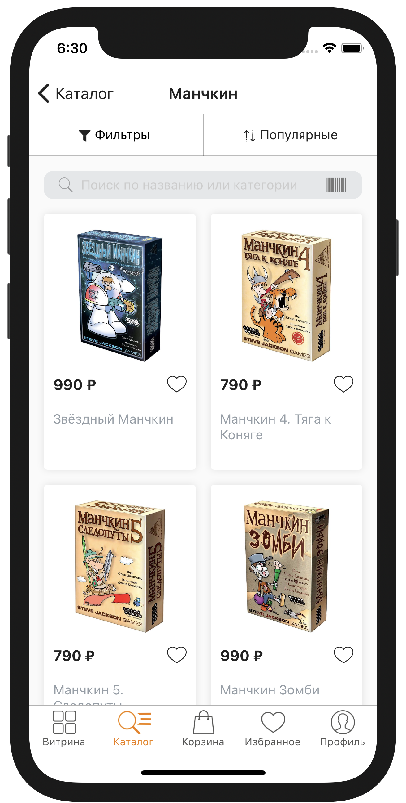
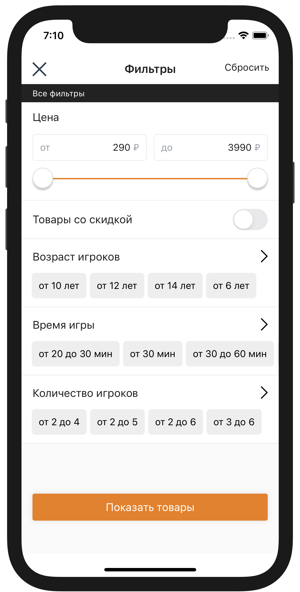

# Поиск. Поисковая выдача


Дополнительные интеграции вводятся в эксплуатацию после завершения основных интеграций:

* [Оформление заказа](../oformlenie-zakaza.-dostavki-oplaty/order.md)
* [Доставки](../oformlenie-zakaza.-dostavki-oplaty/deliveries.md)
* [Оплаты](../oformlenie-zakaza.-dostavki-oplaty/payments.md)

Для подключения дополнительных интеграций обратитесь к вашему менеджеру в IMSHOP.IO



Функция находится в разработке.


## Поиск




**Важно**

Поисковая выдача может быть далее отфильтрована пользователем по цене и другим показателям \(бренд, цвет и т.п.\).

Запрос поиска идёт в паре с запросом фильтров. Нельзя отдельно реализовать запрос поиска без запроса фильтров.


### Формат запроса

* `term` — поисковый запрос
* `location` — локация пользователя, объект «[Местоположение](../obekt-mestopolozhenie.md)»
* `page` — страница выдачи; размер страницы по умолчанию — 10 товаров
* `sort` — режим сортировки; значения: `popular`, `price`, `discount`; по умолчанию `popular`
* `desc` — сортировать по уменьшению; по умолчанию `false`
* `appliedFilters` — примененные фильтры в формате `id: value`

```javascript
{
    "term": "Стиральн",
    "location": {
        "city": "Москва",
        "cityFiasId": "0c5b2444-70a0-4932-980c-b4dc0d3f02b5",
        "region": "Москва",
        "regionFiasId": "0c5b2444-70a0-4932-980c-b4dc0d3f02b5"
    },
    "page": 1,
    "sort": "price",
    "desc": true,
    "appliedFilters": [
        { "brand": "Bosh" },
        { "brand": "Samsung" }
    ]
}
```

### Формат ответа

* `items` — список ID товаров из фида \(`group_id` если есть, иначе `id`\)

```javascript
{
    "items": ["789887", "961551", "55598192"]
}
```

## Фильтры



Запрос фильтров мало чем отличается от запроса поиска товаров. 

### Формат запроса

* `term` — поисковый запрос
* `location` — локация пользователя, объект «[Местоположение](../obekt-mestopolozhenie.md)»
* `appliedFilters` — примененные фильтры в формате `id: value`

```javascript
{
    "term": "Стиральн",
    "location": {
        "city": "Москва",
        "cityFiasId": "0c5b2444-70a0-4932-980c-b4dc0d3f02b5",
        "region": "Москва",
        "regionFiasId": "0c5b2444-70a0-4932-980c-b4dc0d3f02b5"
    },
    "appliedFilters": [
        { "brand": "Bosh" },
        { "brand": "Samsung" }
    ]
}
```

### Формат ответа

* `filters` — набор фильтров в формате:
  * `id` — идентификатор; будет далее использоваться в массиве appliedFilters
  * `title` — отображаемое название
  * `type` — тип; значения: `checkbox`; `toggle`; `range`
  * `units` — единицы измерения
  * `numeric` — фильтр численный
  * `min` — минимум
  * `max` — максимум
  * `values` — допустимые значения

```javascript
{
  "filters": [
    {
      "id": "price",
      "max": 3990,
      "min": 290,
      "title": "Цена",
      "type": "range",
      "units": "Р"
    },
    {
      "id": "discounted",
      "title": "Товары со скидкой",
      "type": "toggle"
    },
    {
      "id": "age",
      "max": 0,
      "min": 0,
      "numeric": false,
      "title": "Возраст игроков",
      "type": "checkbox",
      "values": [
        "от 10",
        "от 12",
        "от 14",
        "от 6"
      ]
    }
  ]
}
```

