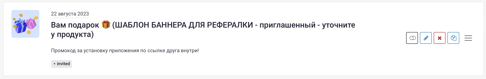

# История заказов



Для авторизованного пользователя доступна синхронизация истории заказов в мобильном приложении с его общей историей заказов.

## Запрос

`APP SERVER → INFRASTRUCTURE`


От вас потребуется URL, на который наш сервер будет слать **POST**-запрос. Да, мы _запрашиваем_ данные через _POST_, а не через _GET_.


В вашу систему будут приходить вот такие данные:

```javascript
{
    "userIdentifier": "12345"
}
```

* `userIdentifier` — идентификатор пользователя \(обязательное поле\), полученный от системы клиента на этапе авторизации

**Ответ:**

```javascript
{
    "orders": [
        {
            "id": "111003",
            "status": "Доставлен в Махачкалу",
            "statusMessage": "Александр, заказ прибыл в ваш город и будет доставлен завтра",
            "price": 1003.33,
            "createdOn": 1613800424,
            "updatedOn": 1613807437,
            "inProgress": true,
            "itemsPrice": 29336,
            "usedBonuses": 0,
            "appliedDiscount": 0,
            "retryPaymentMethod": "payu",
            "trackingUrl": "https://www.cdek.ru/ru/tracking?order_id=1234567890",
            "items": [
                {
                    "privateId": "6527",
                    "configurationId": "3464",
                    "name": "Плюшевый медведь",
                    "image": "https://some.com/files/image.jpg",
                    "price": 29336,
                    "quantity": 1,
                    "discount": 0,
                    "subtotal": 29336
                }
            ],
            "publicDeliveryDetails": {
                "title": "Доставка курьерской службой",
                "details": "Доставка до двери",
                "buyerName": "Александр",
                "buyerEmail": "some@mail.com",
                "buyerPhone": "79998887766",
                "deliveryDate": "2021-02-24",
                "deliveryTime": "до 18:00"
            },
            "publicPaymentDetails": {
                "paid": true,
                "paymentComment": "Оплачено с Apple Pay"
            }
        }
    ]
}
```

* `id` — идентификатор заказа в вашей системе \(обязательное поле\)
* `createdOn` — дата создания заказа \(обязательное поле, [unix time stamp](https://en.wikipedia.org/wiki/Unix_time)\) 
* `status` — статус заказа \(обязательное поле\)
* `statusMessage` — подробное описание статуса заказа \(опционально\)
* `createdOn` - время создания заказа \(unix timestamp в секундах\) \(опционально\)
* `updatedOn` - время последнего обновления заказа \(unix timestamp в секундах\) \(опционально\)
* `inProgress` - true / false - активность заказа. последний активный заказ будет отображен на главном экране приложения \(опционально\)
* `price` — цена заказа \(обязательное поле\)
* `itemsPrice` - цена товаров в заказе без учета скидок, бонусов и предложений \(опционально\)
* `retryPaymentMethod` — отдавать id оплаты если оплата возможна, если нет то null и повторная оплата будет недоступна
* `trackingUrl` — ссылка на страницу отслеживания почтового или курьерского отправления \(необязательное поле\)
* `items` — набор товаров в заказе \(обязательное поле; массив может быть пустым\)
  * `privateId` — идентификатор товара в системе клиента \(обязательное поле\)
  * `configurationId` —идентификатор товарного предложения \(необязательное поле\)
  * `name` — название товара \(обязательное поле\)
  * `image` — URL фото товара \(обязательное поле\)
  * `price` — цена за одну позицию \(необязательное поле\)
  * `quantity` — количество \(обязательное поле\)
  * `discount` — общая скидка \(необязательное поле\)
  * `subtotal` — итоговая стоимость \(обязательное поле\)
* `usedBonuses` - количество использованных бонусов \(опционально\)
* `appliedDiscount` - примененная скидка \(опционально\)
* `publicDeliveryDetails` - детали доставки \(опционально\)
  * `title` - название свособа доставки
  * `details` - подробное описание доставки
  * `buyerName` - имя получателя
  * `buyerPhone` - телефон получателя
  * `buyerEmail` - email получателя
  * `deliveryDate` - ожидаемая дата доставки в формате `YYYY-MM-DD`
  * `deliveryTime` - ожидаемое время доставки в человекочитаемом виде
* `publicPaymentDetails` - детали оплаты
  * `paid` - true если заказ оплачен
  * `paymentComment` - коментарий к платежу

Идентификатор заказа может понадобиться пользователю для уточнения деталей в службе поддержки. Статус заказа — человекочитаемый, демонстрируется пользователю.

Дата создания заказа будет учитываться при сортировке во время слияния с локальной историей заказов.


Следует помнить, что этот запрос будет приходить из нашего доверенного, [авторизованного](../../general.md#avtorizaciya-api) сервера; это — не публичный API.


Любой другой ответ API будет расцениваться как отсутствие истории заказов.

