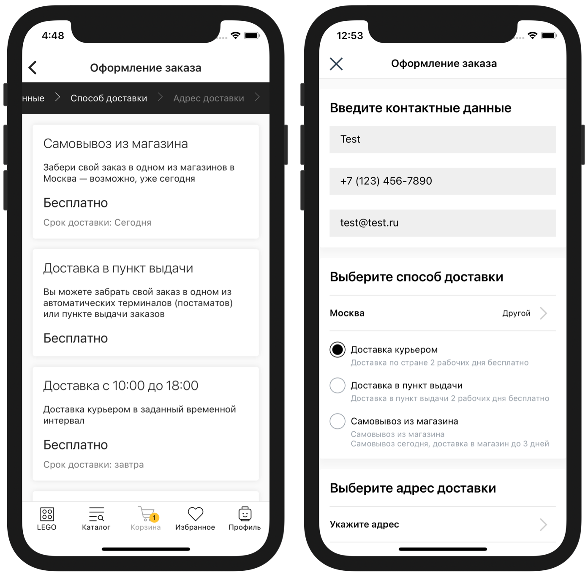
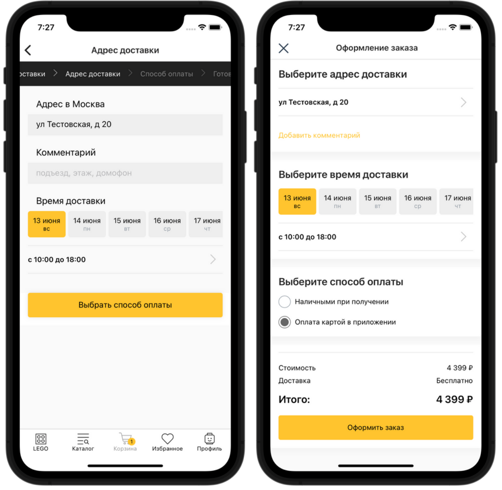

# Доставки




Для подключения вебхука доставок обратитесь к вашему менеджеру в IMSHOP.IO


IMSHOP.IO передаёт состав корзины, город (и страну), а также промокод и идентификатор пользователя, если они есть; в ответ IMSHOP.IO ожидает список доступных способов доставки.


Этот запрос отправляется не только в тех случаях, когда список доставок нужно вывести пользователю. Список доставок также нужен (повторно) перед финальным запросом оформления заказа.


## Формат запроса и пример

### Пример

**`POST`**`https://api-imshop.store.ru/v1/deliveries`

```javascript
{
    "externalUserId": "XXXXXX",
    "country": "RU",
    "hasPreorderItems": true,
    "promocode": null,
    "bonusesSpent": 123
    "addressData": {
        "apt": null,
        "area": null,
        "areaFias": null,
        "areaKladr": null,
        "building": null,
        "city": "Омск",
        "cityFias": "140e31da-27bf-4519-9ea0-6185d681d44e",
        "cityKladr": "5500000100000",
        "city_kladr": "5500000100000",
        "fias": "140e31da-27bf-4519-9ea0-6185d681d44e",
        "fiasCode": "55000001000000000000000",
        "fias_code": "55000001000000000000000",
        "fias_id": "140e31da-27bf-4519-9ea0-6185d681d44e",
        "house": null,
        "houseFias": null,
        "houseKladr": null,
        "kladr": "5500000100000",
        "lat": "54.98",
        "lon": "73.36",
        "region": "Омская",
        "regionFias": "05426864-466d-41a3-82c4-11e61cdc98ce",
        "regionKladr": "5500000000000",
        "settlement": null,
        "settlementFias": null,
        "settlementKladr": null,
        "settlementWithType": null,
        "street": null,
        "streetFias": null,
        "streetKladr": null,
        "value": "г Омск",
        "zip": "644000"
    },
    "items": [
        {
            "name": "Тестовый товар 1",
            "id": "00a03026-412a-54fe-a9df-dcf9325f8618",
            "privateId": "3464",
            "configurationId": "3464",
            "quantity": 1
        },
        {
            "name": "Тестовый товар 2",
            "id": "605e0108-dc95-5dab-95a2-7f459da6aade",
            "privateId": "29117",
            "configurationId": "29117",
            "quantity": 1
        }
    ]
}
```

### Описание формата

* **`externalUserId`** — идентификатор покупателя на стороне клиента, если тот авторизован в мобильном приложении, `null` по умолчанию
* **`country`** — ISO код страны, `RU`
* **`bonusesSpent`** - списанные бонусы
* **`hasPreorderItems `** —  в случае если в запросе товары с предзаказом
* **`addressData`** — подробные данные об адресе доставки (пользователя, не ПВЗ), объект «[Местоположение](../obekt-mestopolozhenie.md)»
* **`promocode`** — прикрепленный промокод, `null` по умолчанию
* **`skipPickupLocations`** — если этот параметр передан, и он равен `true`, то в ответе достаточно передать только способ самовывоза, и не передавать все доступные точки получения заказа
* **`items`** - список товаров в корзине
  * **`id`** — идентификатор товара в IMSHOP.IO
  * **`configurationId`** — идентификатор товарного предложения в системе клиента (идентификатор из фида)
  * **`privateId`** — идентификатор товара в системе клиента (`group_id` из фида)
  * **`quantity`** — количество


В запросе может приходить гораздо больше информации. Например, для товаров могут приходить названия.

Дополнительные поля могут облегчить процесс отладки, но не являются частью спецификации, на них нельзя базировать программную логику.


## Формат ответа и пример

### Описание формата


**Обяз**. — обязательное поле.


* **`deliveries`** — список доступных способов доставки, массив
  * **`id`** — идентификатор, строка, **обяз**.
  * **`title`** — название, строка, **обяз**.
  * **`description`** — описание, строка
  * **`type`** — тип (`delivery`, `pickup` — доставка или самовывоз), **обяз**.
  * **`price`** — минимальная цена, цифра, **обяз**.
  * **`priceLabel`** — цена в свободной форме; строка; приоритетнее поля `price`
  * **`min`** — минимальный срок доставки (`0` - сегодня, `1` - завтра, `2`-послезавтра, `3`- от 3 дней), **обяз**.
  * **`max`** — максимальный срок доставки (`0` - сегодня, `1` - завтра итд)
  * **`timeLabel`** — время доставки в виде текста (отображается на экране выбора способа доставки)
  * **`locations`** — список ПВЗ (если `type` = `pickup` и требуется выбор пункта самовывоза, и в запросе не передан `skipPickupLocations` = `true`)
    * **`id`** — идентификатор самовывоза, строка, **обяз**.
    * **`title`** — название, строка, **обяз**.
    * **`address`** — адрес, строка, **обяз**.
    * **`city`** — город, строка, **обяз**.
    * **`time`** — расписание / время работы, строка
    * **`subway`** — ближайшая станция метро, строка
    * **`mall`** — название ТЦ, если не указывается в поле `title`
    * **`lat`** — широта для отображения на карте, строка, **обяз**.
    * **`lon`** — долгота для отображения на карте, строка, **обяз**.
    * **`price`** — цена доставки в этот ПВЗ, цифра, **обяз**.
    * **`min`** — ожидаемое время доставки (`0` - сегодня), цифра, **обяз**.
    * **`timeLabel`** — время доставки в виде текста (отображается на экране выбора пункта получения заказа и на экране описания пункта самовывоза), строка
    * **`notice`** - (в разработке) опционально, выделенный текстовый блок, например, чтобы уведомить покупателя, что не все товары доступны в данном ПВЗ
  * **`groupName`** — (опционально) идентификатор для группировки, строка (способы доставки, у которых значение группы совпадает, схлопываются в один пункт; после его выбора, пользователь увидит все пункты, входящие в эту группу)

### Пример

```javascript
{
    "deliveries": [
        {
            "id": "regular",
            "title": "Доставка курьером",
            "description": "Доставка курьерской службой по города на следующий день",
            "type": "delivery",
            "price": 350,
            "min": 1,
            "timeLabel": "На следующий день"
        },
        {
            "id": "pickup",
            "title": "Самовывоз из магазина",
            "description": "Самовывоз заказа из магазина в день заказа",
            "type": "pickup",
            "price": 0,
            "min": 0,
            "timeLabel": "В день заказа",
            "locations": [{
                "id": "a0001",
                "title": "Гидропроект",
                "address": "Волоколамское шоссе 2",
                "city": "Москва",
                "time": "Каждый день с 10 до 22",
                "subway": "Сокол",
                "mall": "",
                "lat": "55.8078034",
                "lon": "37.5054127",
                "price": 0,
                "min": 0,
                "timeLabel": "Сегодня после 14:00"
            }]
        }
    ]
}
```

### Интервалы доставки



Могут быть добавлены в любой из элементов списка доставок, имеющих тип `delivery`

* **`dateIntervals`** — список доступных интервалов, привязанных к датам
  * **`id`** — идентификатор в вашей системе, число или строка
  *   **`title`** — название (конкретная дата), строка

      **`subTitle`** — пояснение (день недели), строка
  * **`timeIntervals`** — список доступных интервалов, привязанных ко времени
    * **`id`** — идентификатор в вашей системе, число или строка
    * **`title`** — название (отрезок времени), строка

```javascript
{
    "deliveries": [
        {
            "id": "regular",
            "title": "Доставка курьером",
            "type": "delivery",
            "price": 350,
            "min": 1,
            "dateIntervals": [
                {
                    "id": "21-06-10",
                    "title": "21 июн",
                    "subTitle": "завтра",
                    "timeIntervals": [
                        {
                            "id": "10-15",
                            "title": "с 10:00 до 15:00"
                        },
                        {
                            "id": "15-20",
                            "title": "с 15:00 до 20:00"
                        }
                    ]
                },
                {
                    "id": "22-06-10",
                    "title": "22 июн",
                    "subTitle": "послезавтра",
                    "timeIntervals": [
                        {
                            "id": "10-15",
                            "title": "с 10:00 до 15:00"
                        },
                        {
                            "id": "15-20",
                            "title": "с 15:00 до 20:00"
                        }
                    ]
                }                
            ]
        }
    ]
}
```
