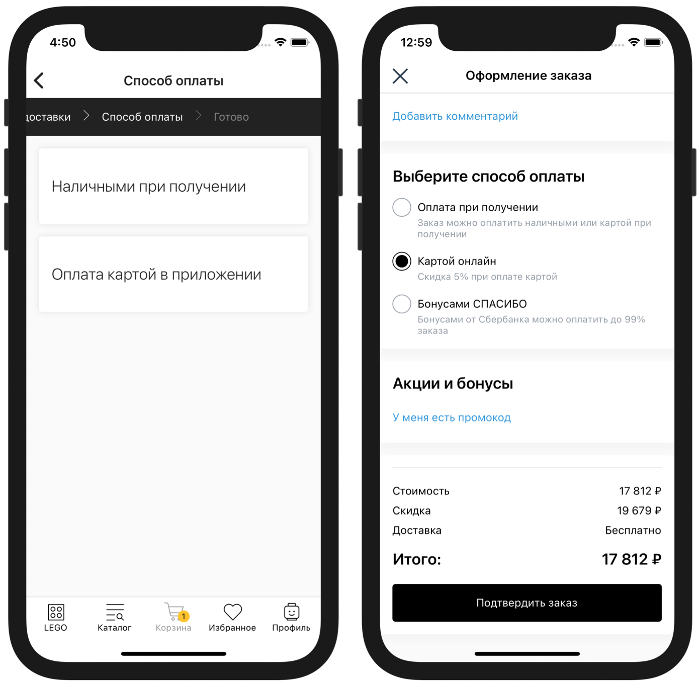

# Оплаты




Для подключения вебхука оплат обратитесь к вашему менеджеру в IMSHOP.IO


IMSHOP.IO передаёт выбранный способ доставки (id), состав корзины, город (и страну), а также промокод и идентификатор пользователя, если они есть; в ответ IMSHOP.IO ожидает список доступных способов оплаты.


Этот запрос отправляется не только в тех случаях, когда список доставок нужно вывести пользователю. Список доступных способов оплаты также нужен (повторно) перед финальным запросом оформления заказа.


## Формата запроса и пример

### Пример

**`POST`**`https://api-imshop.store.ru/v1/payments`

```javascript
{
    "externalUserId": "XXXXXX",
    "country": "RU",
    "hasPreorderItems": true,
    "city": "Москва",
    "promocode": null,
    "deliveryId": "14",
    "pickupLocationId": "100",
    "bonusesSpent": 250,
    "items": [
        {
            "name": "Тестовый товар 1",
            "id": "00a03026-412a-54fe-a9df-dcf9325f8618",
            "privateId": "3464",
            "configurationId": "3464",
            "quantity": 1
        },
        {
            "name": "Тестовый товар 2",
            "id": "605e0108-dc95-5dab-95a2-7f459da6aade",
            "privateId": "29117",
            "configurationId": "29117",
            "quantity": 1
        }
    ]
}
```

### Описание формата

* **`externalUserId`** — идентификатор покупателя на стороне клиента, если тот авторизован в мобильном приложении, `null` по умолчанию
* **`country`** — ISO код страны, `RU`
* **`hasPreorderItems`** —  в случае если в запросе товары с предзаказом
* **`city`** — стандартизированное имя города из системы ФИАС (или UUID ФИАС, в зависимости от настроек)
* **`promocode`** — прикрепленный промокод в виде строки, `null` по умолчанию
* **`deliveryId`** — идентификатор выбранного способа доставки, см. «[Доставки](deliveries.md)»
* **`pickupLocationId`** — выбранный пункт получения заказа, см. «[Доставки](deliveries.md)» (`null`, если доставка или не подразумевает выбора ПВЗ)
* **`bonusesSpent`** — кол-во бонусов которые пользователь планирует потратить
* **`items`** — список товаров в корзине
  * **`id`** — идентификатор товара в IMSHOP.IO
  * **`configurationId`** — идентификатор товарного предложения в системе клиента (идентификатор из фида)
  * **`privateId`** — идентификатор товара в системе клиента (`group_id` из фида)
  * **`quantity`** — количество


Для маркетплейсов.

В полях запроса для каждого товара могут быть переданы идентификаторы магазина/ООО (**в разработке**).


* **`warehouseId`** — (опционально) идентификатор склада/магазина/аутлета/ООО из [фида наличия для маркетплейсов](../../sync/availability-feed-for-marketplaces.md)

```json
{    
    ...
    "items": [
        {
            ...
            "warehouseId": "AF-1416"
            ....
        }
    ]
    ...
}
```


В запросе может приходить гораздо больше информации. Например, для товаров могут приходить названия.&#x20;

Дополнительные поля могут облегчить процесс отладки, но не являются частью спецификации, на них нельзя базировать программную логику.


## Ответ


**Обяз**. — обязательное поле.


### Описание формата

* **`payments`** — список доступных способов оплаты
  * **`id`** — идентификатор, строка, **обяз**.
  * **`title`** — название, строка, **обяз**.
  * **`description`** — описание, строка
  * **`type`** — тип из перечисленных, **обяз**.:
    * `cash` - оплата наличнами
    * `card_on_delivery` - картой курьеру или при получении
    * `card` - картой в приложении
    * `iOS` - Apple Pay
    * `android` - Google Pay (в разработке)

### Пример

```javascript
{
    "payments": [
        {
            "id": "13",
            "title": "Оплата наличными при получении",
            "description": "Оплата наличными курьеру при получении заказа",
            "type": "cash"
        },
        {
            "id": "001",
            "title": "Картой в приложении",
            "description": "Оплата картой visa или mastercard в приложении",
            "type": "card"
        }
    ]
}
```
