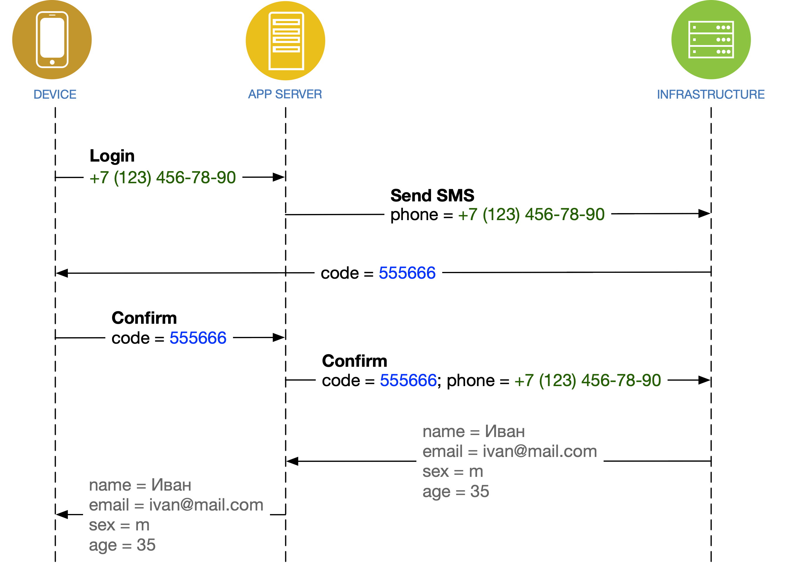

# Отправка одноразового пароля




**OTP** = one-time password, одноразовый пароль


«Золотой» сценарий:

1. Пользователь вводит номер телефона \(или адрес email\)
2. Мобильное приложение отправляет запрос **OTP** в сервер IMSHOP.IO
3. Сервер IMSHOP.IO запрашивает отправку **OTP** в вашей инфраструктуре
4. Вы отправляете SMS \(или электронное письмо\), содержащее **OTP**
5. Пользователь вводит **OTP**
6. Мобильное приложение отправляет **OTP** в сервер IMSHOP.IO
7. Сервер IMSHOP.IO запрашивает подтверждение **OTP** в вашей инфраструктуре
8. Ваша инфраструктура подтверждает введенный **OTP**, а также возвращает данные пользователя 

### Запрос OTP

`APP SERVER → INFRASTRUCTURE`


От вас потребуется URL, на который наш сервер будет слать **POST**-запрос.


В вашу систему будут приходить вот такие данные:

```javascript
{
    "user_identifier": "71234567890"
}
```

* `user_identifier` — идентификатор пользователя \(обязательное поле\)

Идентификатор пользователя — это номер телефона, адрес email, или любой другой идентификатор \(например, логин\), как договоримся. В случае с номером телефона мы присылаем только цифры, через семёрку.

**Ответ:**

```javascript
{
    "otp": {
        "timeout": 30,
        "attempts_left": 3,
        "message": "На номер +7 (965) ***-**-00 отправлено сообщение с кодом"
    }
}
```

* `timeout` — сколько секунд осталось до возможности повторно запросить **OTP** \(необязательное поле\)
* `attempts_left` — сколько осталось попыток входа \(необязательное поле\)
* `message` — сообщение для пользователя \(обязательное поле\)


Номера телефонов стоит частично маскировать, чтобы у вас не увели базу данных пользователей, но владелец номера всё равно мог понять, куда именно ему придёт SMS.


**Ошибка: отправка OTP невозможна**

Возможно, SMS-шлюз не отзывается, либо вы по какой-то причине не хотите авторизовывать пользователя с таким идентификатором.

```javascript
{
    "error": {
        "message": "Превышено количество попыток входа"
    }
}
```

* `message` — сообщение для пользователя, описывающее проблему \(обязательное поле\)


Запрос нового **OTP** осуществляется посредством повторной отправки этого же запроса.


### Подтверждение OTP

`APP SERVER → INFRASTRUCTURE`


От вас потребуется URL, на который наш сервер будет слать **POST**-запрос.


В вашу систему будут приходить вот такие данные:

```javascript
{
    "user_identifier": "71234567890",
    "otp": "555666"    
}
```

* `user_identifier` — идентификатор пользователя \(обязательное поле\)
* `otp` — пароль, введенный пользователем \(обязательное поле\)

Чтобы **OTP** в SMS корректно воспринимался операционными системами iOS и Android, он должен содержать только цифры. Шесть штук. Такой формат позволит автоматически вставлять код из SMS одним нажатием. Если вы хотите другой формат — _сообщите нам заранее,_ нам необходимо будет заменить валидацию_._

**Ответ:**

```javascript
{
    "user": {
        "user_identifier": "71234567890",
        "name": "Иванов Иван",
        "phone": "71234567890",
        "email": "ivanov@mail.com",
        "bonuses": 10000,
        "segments": ["registered", "loyal"],
        "age": 35,
        "gender": "male"
    }
}
```

* `user_identifier` — идентификатор пользователя \(обязательное поле\)
* `name` — имя пользователя, достаточное для оформления заказа \(необязательное поле\)
* `phone` — номер телефона пользователя \(необязательное поле\)
* `email` — адрес электропочты пользователя \(необязательное поле\)
* `bonuses` — количество бонусов на счету пользователя \(необязательное поле\)
* `segments` — сегменты, к которым относится пользователя \(необязательное поле\)
* … и любые другие поля.

В случае, если пользователь новый, и информации по нему никакой нет — допустимо присылать пустые поля, или не присылать их вовсе. Любой ответ, не содержащий ключа **`error`**, будет расцениваться как успешный.

**Ошибка: подтверждение OTP не произошло**

Возможно, пользователь ввёл неправильные цифры. Возможно, на вашей стороне произошла какая-то другая ошибка. Возможно, вы передумали авторизовывать этого пользователя.

```javascript
{
    "error": {
        "message": "Неправильный код"
    }
}
```

