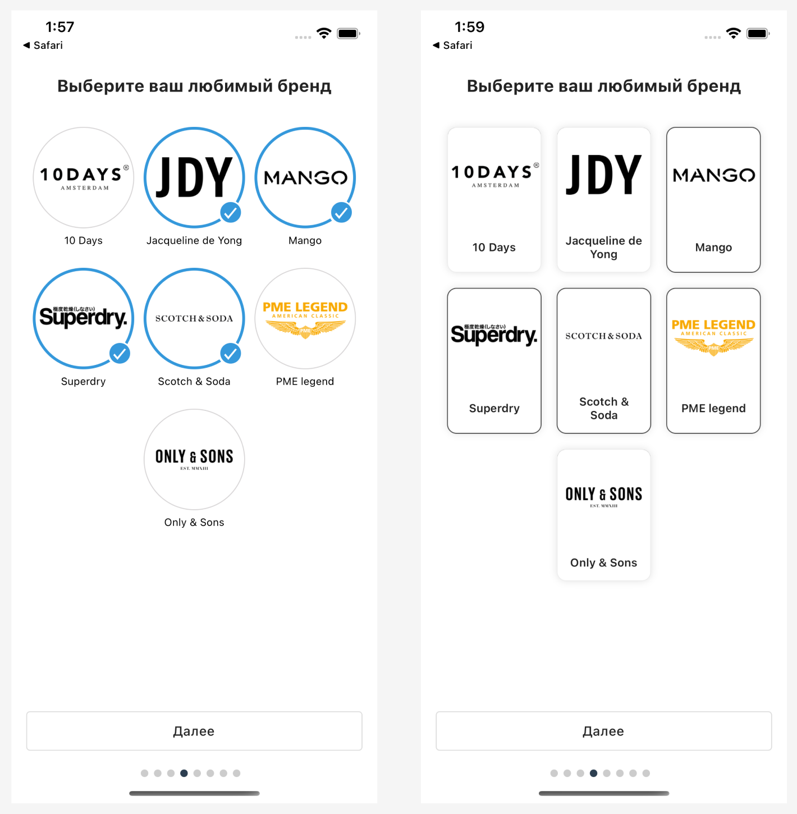
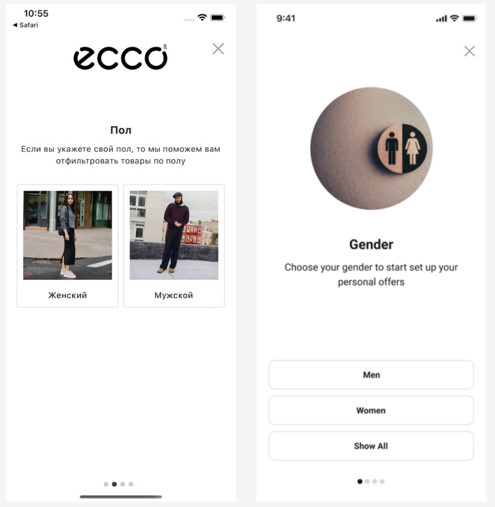
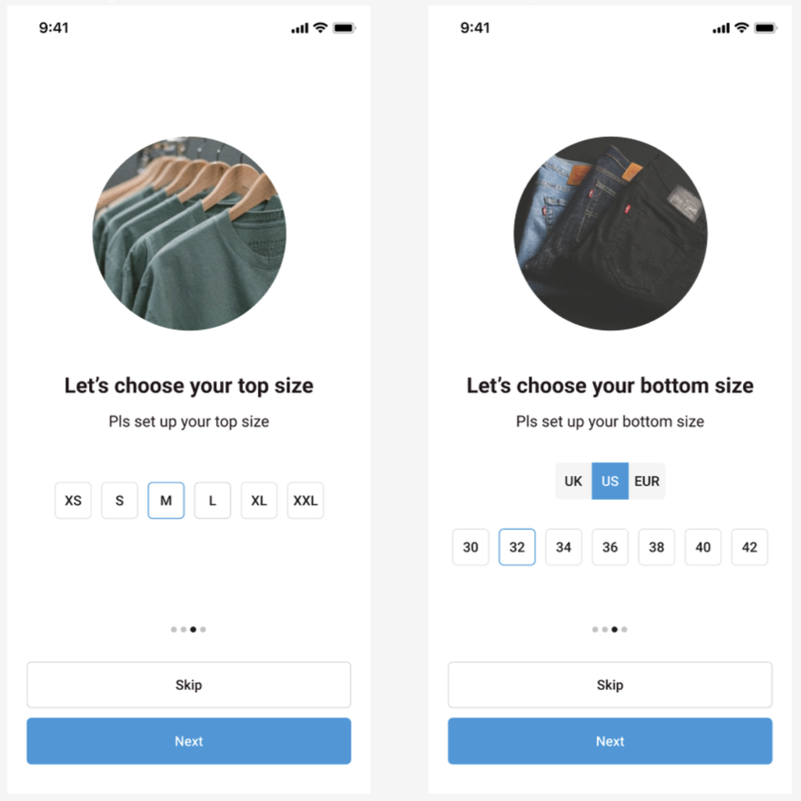
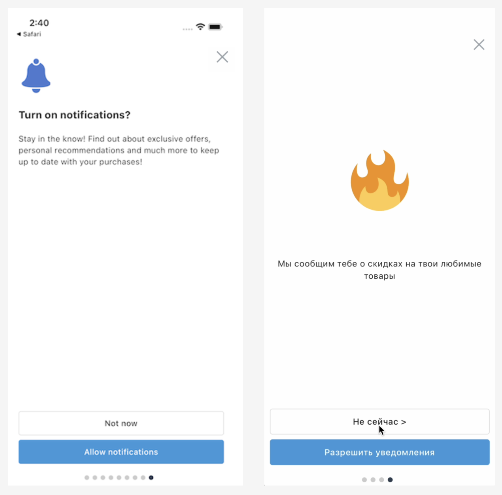
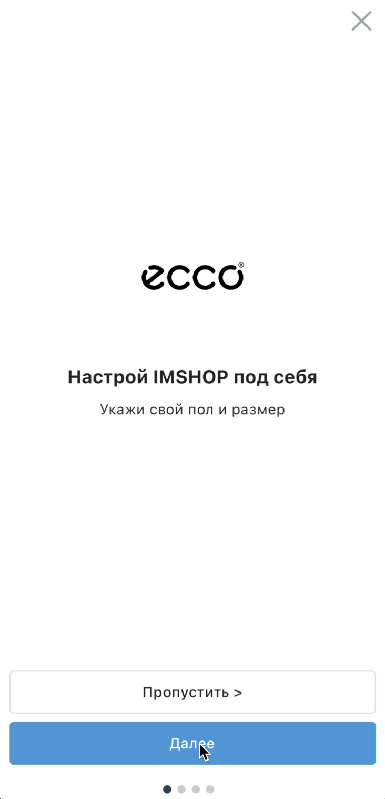

# Онбоардинг

### Зачем нужен и когда используется

Помогает задать предпочтения пользователя для более быстрого пути до покупки.

Так же является поводом запросить повторно разрешения на пуш уведомления.

Онбоардинг можно запускать на первом старте приложения или в любое время по диплинку (клик на баннере или по кнопке в профиле)

> Для подключения онбоардинга обратитесь к вашему product manager. Доступно на тарифе с персонализацией

### Сегментация по любимым брендам

<figure><figcaption>
пример экранов онбоардинга, отвечающих за выбор бренда
</figcaption></figure>

Используется для автоматической фильтрации витрины в приложении у покупателя, а так же для быстрых фильтров в каталоге

### Узнайте пол покупателя

<figure><figcaption>
пример экранов онбоардинга, отвечающих за выбор пола
</figcaption></figure>

Используется для автоматической фильтрации витрины в приложении у покупателя, а так же для быстрых фильтров в каталоге

Можно использовать для фильтрации по полу следующих экранов онбоардинга, например, если хотите отобразить женщинам только женские бренды для выбора

### Работа с остатками размеров и быстрые фильтры по размерам

<figure><figcaption>
пример экранов онбоардинга, отвечающих за выбор размера
</figcaption></figure>

Используется для автоматической фильтрации витрины в приложении у покупателя, а так же для быстрых фильтров в каталоге

Можно использовать для продажи остатков размеров по товарав, ваши баннеры увидят только покупатели, выбравшие нужный вам размер

В случае необходимости покупатель сможет поменять свой размер в профиле

### Быстрые фильтры по любым параметрам из фида

<figure><figcaption>
пример экранов онбоардинга, отвечающих за выбор кастомных параметров
</figcaption></figure>

Если у вас в фиде есть параметры, по которым бы вам хотелось фильтровать каталог или витрину, используйте эти экраны онбоардинга

### Повторный запрос включения пуш уведомлений

<figure><figcaption>
пример экранов онбоардинга, отвечающих за включение пуш уведомлений
</figcaption></figure>

Если покупатель запретил отправлять ему пуш уведомления, этими экранами мы можем напомнить ему, почему ему полезно иметь их включенными

### Стартовый экран онбоардинга, чтобы показать покупателю, что мы от него хотим 

<figure><figcaption></figcaption></figure>


Для подключения онбоардинга обратитесь к вашему product manager. Доступно на тарифе с персонализацией


