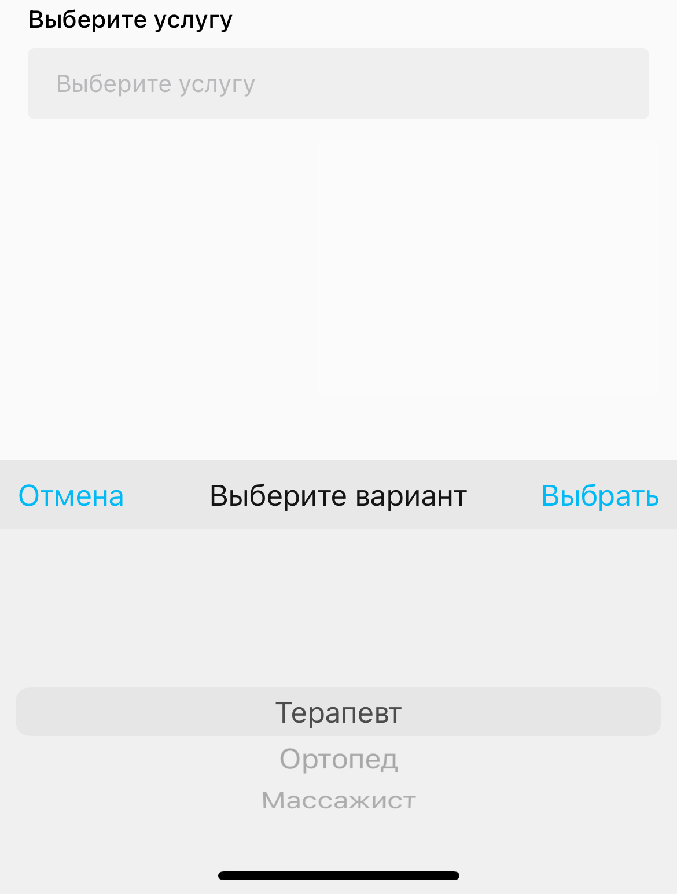

# Динамические формы


Динамические формы – формы на сабтудеях с возможностью подгрузки дополнительных элементов форм на основе введенных пользователем данных.

Для корректной работы динамических форм необходимо включение интеграции.

Конечные результаты форм могут отправляться по [вебхуку выгрузки форм.](broken-reference)


## Оглавление

* [Заведение сабтудея с поддержкой динамических форм](dinamicheskie-formy.md#zavedenie-sabtudeya-s-podderzhkoi-dinamicheskikh-form)
* [Механизм работы вебхук-интеграции](dinamicheskie-formy.md#mekhanizm-raboty-webhook-integracii)
* [Элементы формы](dinamicheskie-formy.md#elementy-formy)
  * [Заголовок (title)](dinamicheskie-formy.md#zagolovok-title)
  * [Барабан (picker)](dinamicheskie-formy.md#baraban-picker)
  * [Чекбокс (checkbox)](dinamicheskie-formy.md#chekboks-checkbox)
  * [Поле ввода текста (text)](dinamicheskie-formy.md#pole-vvoda-teksta-text)
  * [Поле ввода эл.почты (email)](dinamicheskie-formy.md#pole-vvoda-el.pochty-email)
  * [Поле ввода телефона (phone)](dinamicheskie-formy.md#pole-vvoda-telefona-phone)
  * [Поле ввода даты (date)](dinamicheskie-formy.md#pole-vvoda-daty-date)
  * [Кнопка завершения редактирования формы (submit)](dinamicheskie-formy.md#submit)
  * [Примечание (notice)](dinamicheskie-formy.md#primechanie-notice)
  * [Сообщение после заполнения формы (alert)](dinamicheskie-formy.md#soobshenie-posle-zaversheniya-zapolneniya-forsy-alert)
* [Запрос клиентом следующих элементов формы](dinamicheskie-formy.md#zapros-klientom-sleduyushikh-elementov-formy)

### Заведение сабтудея с поддержкой динамических форм

В консоли при создании элементов сабтудея необходимо завести форму, дать ей идентификатор (для примера, `form123`) и отметить, что данная форма будет загружаться по вебхуку.


### Механизм работы webhook-интеграции

При посещении пользователем сабтудея с динамической формой происходит запрос начальной формы. Вам приходит название запрашиваемой формы:

```
{
  formName: 'form123'
}
```

В ответ сервер должен отправить содержание формы:

```
{
  "success": true,
  "name": "form123",
  "form": {
    "alertText": "We have received your feedback.",
    "alertTitle": "Thanks for participating",
    "title": "Запишитесь сегодня!",
    "elements": [...],
  }
}
```

* success – boolean, успех отправки формы
* name – название запрашиваемой и отправляемой формы
* form
  * alertText и alertTitle – [заголовок и текст сообщения после заполнения формы](dinamicheskie-formy.md#primechanie-notice-1)
  * title – [заголовок формы](dinamicheskie-formy.md#zagolovok-title)
  * elements – массив с [элементами формы](dinamicheskie-formy.md#elementy-formy)

Элементы формы в elements могут располагаться в произвольном порядке.

### Элементы формы

#### Заголовок (title)

Заголовок или произвольная надпись в форме жирным шрифтом. Не распологается произвольно, всегда находится сверху формы.

Передается в `form`

```
"title": "Запишитесь сегодня!"
```


#### Барабан (picker)

Поле, при нажатии которого появляется барабан с возможностью выбора одного варианта.

Передается в `elements`

```
{
  "name": "service",
  "placeholder": "Выберите услугу",
  "required": true,
  "type": "picker",
  "title": "Выберите услугу",
  "list": ["Терапевт", "Ортопед", "Массажист"],
  "nextElementsNames": ["date"]
}
```

* name – идентификатор элемента
* placeholder – плейсхолдер для поля ввода
* required – true/false, является для данный элемент обязательным для заполнения
* type – тип элемента (picker)
* title – заголовок элемента
* list – массив из строк с вариантами выбора
* nextElementsNames – [подгрузка следующих элементов формы](dinamicheskie-formy.md#undefined)




#### Чекбокс (checkbox)

Чекбокс.

Передается в `elements`

```
{
  "name": "checkbox",
  "title": "Перезвоните мне",
  "type": "checkbox"
}
```

* name – идентификатор элемента
* type – тип элемента (checkbox)
* title – надпись справа от чекбокса


#### Поле ввода текста (text)

Поле для ввода текста.

Передается в `elements`

```
{
  "name": "username",
  "placeholder": "Имя",
  "title": "Введите имя",
  "required": true,
  "type": "text"
}
```

* name – идентификатор элемента
* placeholder – плейсхолдер для поля ввода
* required – true/false, является для данный элемент обязательным для заполнения
* type – тип элемента (text)
* title – заголовок элемента

.png>)


#### Поле ввода эл.почты (email)

Поле с форматированием электронной почты.

Передается в `elements`

```
{
  "name": "email",
  "title": "Эл.почта",
  "placeholder": "Введите адрес",
  "required": true,
  "type": "email"
}
```

* name – идентификатор элемента
* placeholder – плейсхолдер для поля ввода
* required – true/false, является для данный элемент обязательным для заполнения
* type – тип элемента (email)
* title – заголовок элемента


#### Поле ввода телефона (phone)

Поле с форматированием телефонного номера.

Передается в `elements`

```
{
  "name": "phone",
  "title": "Телефон",
  "placeholder": "Введите телефон",
  "required": true,
  "type": "phone"
}
```

* name – идентификатор элемента
* placeholder – плейсхолдер для поля ввода
* required – true/false, является для данный элемент обязательным для заполнения
* type – тип элемента (phone)
* title – заголовок элемента


#### Поле ввода даты (date)

Поле, при нажатии которого отображается барабан с возможностью ввода даты.

Передается в `elements`

```
{
  "name": "dob",
  "title": "Дата рождения",
  "placeholder": "Выберите дату рождения",
  "required": true,
  "type": "date"
}
```

* name – идентификатор элемента
* placeholder – плейсхолдер для поля ввода
* required – true/false, является для данный элемент обязательным для заполнения
* type – тип элемента (text)
* title – заголовок элемента


#### Кнопка завершения редактирования формы (submit) <a href="#submit" id="submit"></a>

Кнопка завершения заполнения формы, при нажатии данные [отправляются на сервер](broken-reference) и [появляется сообщение](dinamicheskie-formy.md#primechanie-notice-1).

Передается в `elements`

```
{
  "name": "submitBtn",
  "placeholder": "Записаться",
  "disabledPlaceholder": "Заполните поля",
  "type": "submit"
}
```

* name – идентификатор элемента
* placeholder – надпись на кнопке
* disabledPlaceholder – надпись на кнопке в заблокированном состоянии ( когда пользователь не ввел данные в обязательные поля)
* type – тип элемента (submit)


#### Примечание (notice)

Примечание, надпись мелким шрифтом.

Передается в `elements`

```
{
  "name": "notice",
  "placeholder": "Заполняя форму, вы соглашаетесь с условиями обработки персональных данных.",
  "type": "notice"
}
```

* name – идентификатор элемента
* placeholder – надпись
* type – тип элемента (notice)


#### Ссылка (url)

Текст, по нажатию на который открывается ссылка.

Передается в `elements`

```
{
  "name": "url",
  "title": "Test url",
  "redirectTo": "https://google.com",
  "useExternalBrowser": false,
  "alignToLeft": false
  "type": "url"
}
```

* name – идентификатор элемента
* title – надпись
* redirectTo – ссылка (поддерживаются диплинки)
* useExternalBrowser – true/false, открывать ссылку во внешнем браузере (по умолчанию false)
* alignToLeft – сместить текст к левому краю (по умолчанию false)
* type – тип элемента (notice)


#### Сообщение после завершения заполнения формы (alert)

Сообщение, которое отображается после нажатия на [сабмит](dinamicheskie-formy.md#knopka-zaversheniya-redaktirovaniya-formy-submit).

Передается в `form`

```
"alertText": "We have received your feedback. Thanks for participating.",
"alertTitle": "Thanks for participating",
```

* alertTitle – заголовок сообщения
* alertText – тело сообщения


### Запрос клиентом следующих элементов формы

При выборе значения в [барабане](dinamicheskie-formy.md#baraban-picker) и наличии в барабане массива с идентификаторами следующих полей `nextElementsNames` происходит дозапрос от сервера следующих элементов формы.

Сервер принимает JSON с введенными пользователем значениями в поле `data`, где ключ – идентификатор элемента как в поле `name` в отправленных элементах:

```
{
  formName: 'form123',
  data: {
    checkbox: true,
    text: 'Some text',
    phone: '+7 (111) 111-1111',
    email: 'test@imshop.io',
    date: '25 января',
    picker: 'Ортопед'
  },
  nextElementsNames: [ 'next_services' ]
}
```

В ответ сервер отправляет следующие элементы форм, например:

```
{
  "name": "form123",
  "success": true,
  "elements": [
    {
      "name": "date",
      "placeholder": "Выберите дату",
      "required": true,
      "type": "picker",
      "title": "Выберите дату",
      "list": [
        "26 мая",
        "27 мая",
        "28 мая",
        "29 мая",
        "30 мая",
        "31 мая",
      ],
      "nextElementsNames": ["time"]
    }
  ]
}
```

В передаваемых далее барабанах могут содержаться дальнейшие идентификаторы полей.

Новые элементы формы могут дозапрашиваться сколько угодно раз, окончанием заполнения формы всегда считается нажатие на [сабмит](dinamicheskie-formy.md#submit).

Конечные результаты форм могут отправляться по [вебхуку выгрузки форм.](eksport-form.md)
