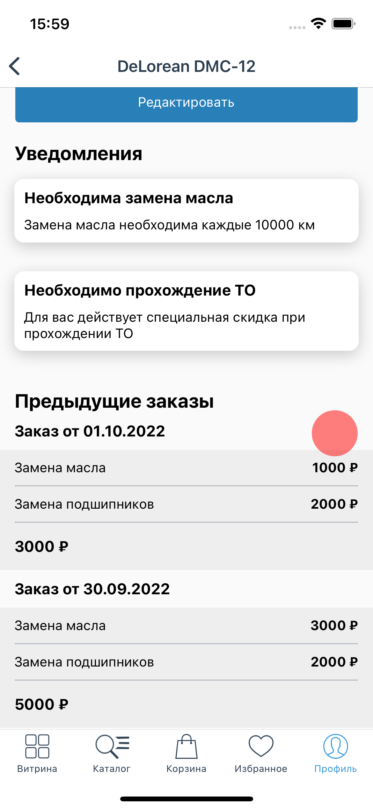
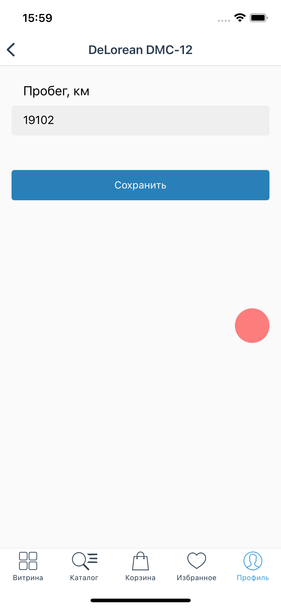
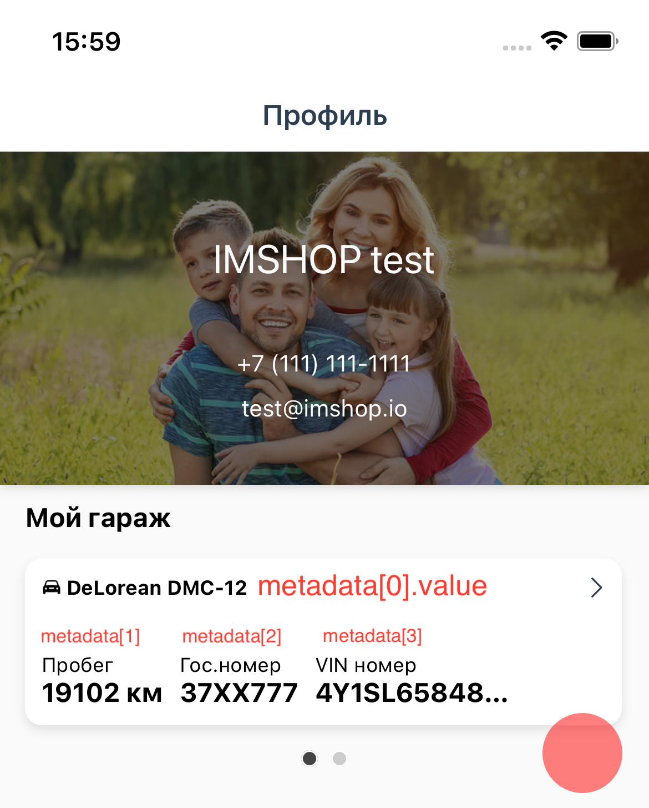
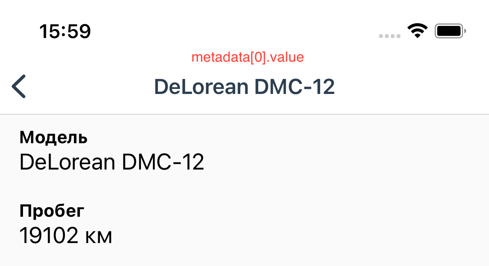
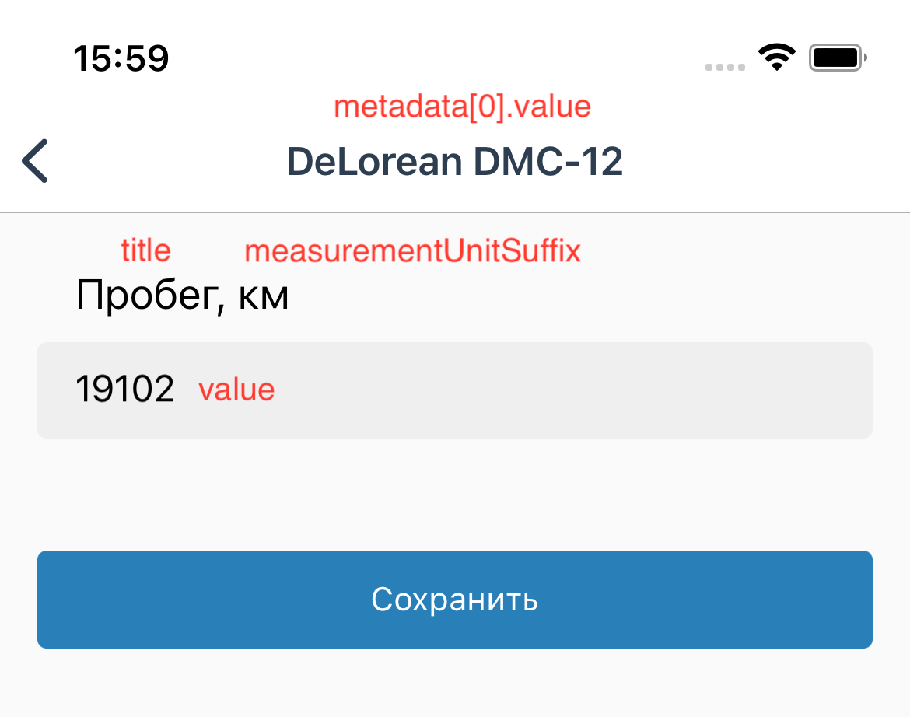
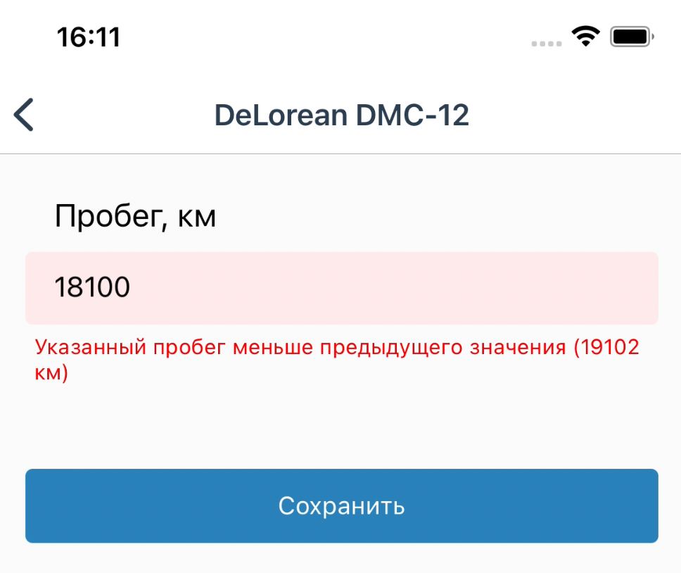
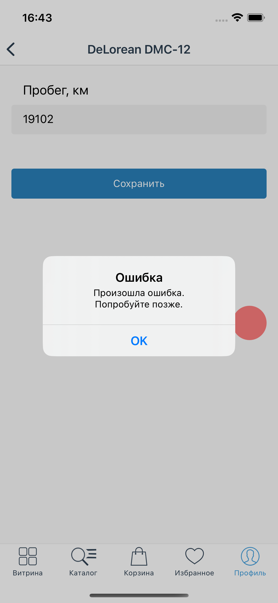

# Коллекции


Коллекции позволяют отображать привязанные к профилю пользователя сущности (товары и пр.) и позволяют реализовать такие разделы, как, например, "Мой гараж", "Мои дети" и др.

Обратитесь к вашему product-менеджеру для подключения интеграций.


<div>

<figure><figcaption></figcaption></figure>

 

<figure><figcaption></figcaption></figure>

 

<figure><figcaption></figcaption></figure>

 

<figure><figcaption></figcaption></figure>

</div>

### Получение коллекций через webhook-интеграцию

Клиентское приложение запрашивает коллекции при каждом заходе в приложение и при свайпе на обновление в разделе профиля.

Сервер получает внешний userId и список идентификаторов отключенных коллекций, по умолчанию пустой.

```
{
  "userId": "1",
  "disabledCollections": []
}
```

В ответ сервер передает коллекции пользователя. Все поля обязательны, если в описании не указано обратное.

```
[{
  collectionId: 'auto',
  createdOn: '1577910417',
  updatedOn: '1664656017',
  title: 'Мой гараж',
  units: [
    {
      unitId: 'id1',
      metadata: [
        {
          id: 'model',
          title: 'Модель',
          value: 'DeLorean DMC-12',
        },
        {
          id: 'mileage',
          title: 'Пробег',
          value: '19102',
          inputType: 'number',
          measurementUnitSuffix: 'км',
        },
        {
          id: 'licensePlate',
          title: 'Гос.номер',
          value: '37XX777',
        },
        {
          id: 'lastService',
          title: 'Последнее обслуживание',
          value: '01.10.2022',
        },
        ...
      ],
      alerts: [
        {
          title: 'Необходима замена масла',
          description: 'Замена масла необходима каждые 10000 км',
        },
        {
          title: 'Необходимо прохождение ТО',
          description: 'Для вас действует специальная скидка при прохождении ТО',
        },
        ...
      ],
      orders: [
        {
          orderId: 'order1',
          title: 'Заказ от 01.10.2022',
          totalPrice: 3000,
          positions: [
            {
              title: 'Замена масла',
              price: 1000,
            },
            {
              title: 'Замена подшипников',
              price: 2000,
            },
          ],
        },
        ...
      ],
      createdOn: '1621456017',
      updatedOn: '1664656017',
    },
    ...
}]
```

* collectionId – string, идентификатор коллекции
* createdOn – string, Unix-timestamp создания коллекции, необязательно
* updatedOn – string, Unix-timestamp обновления коллекции, необязательно
* title – string, название коллекции в приложении
* units – список элементов коллекции
  * unitId – идентификатор элемента
  * metadata – список характеристик. Первый элемент списка используется как заголовок в карточке элемента.
    * id – string, идентификатор характеристики
    * title – string, заголовок характеристики
    * value – string, значение характеристики
    * inputType – string, тип редактирования характеристики. Необязательно. Необходимо использовать, если поле доступно для редактирования. Допустимые значения: `number` для ввода числового значения и `string` для ввода текста.
    * measurementUnitSuffix – string, единица измерения, необязательно. Например, если вы хотите передать километраж, который доступен для редактирования, то необходимо передать в поле `value` значение километража, а в `measurementUnitSuffix` передать единицы измерения (например, "км"). В остальных случаях значение вместе с единицами измерения можно передать напрямую в `value`.
  * alerts – список уведомлений по элементу. Необязательно.
    * title – заголовок уведомления
    * value – текст уведомления
  * orders – список заказов/услуг по элементу. Необязательно.
    * orderId – string, идентификатор заказа
    * title – string, заголовок заказа
    * totalPrice – number, общая стоимость заказа
    * positions – список позиций заказа
      * title – string, наименование
      * price – number, стоимость позиции
  * createdOn – string, Unix-timestamp создания элемента, необязательно
  * updatedOn – string, Unix-timestamp обновления элемента, необязательно

### Использование metadata







### Обновление элемента коллекции

При запросе на редактирования элемента коллекции сервер получает следующее сообщение:

```
{
  "userId": "1",
  "collectionId": "auto",
  "unitId": "unit1",
  "entries": [
    {
      "id": "mileage",
      "value": "20900",
    },
    ...
  ]
}
```

* userId – string, внешний индентификатор пользователя
* collectionId – string, идентификатор редактируемой коллекции
* unitId – string, идентификатор редактируемого элемента
* entries – список всех характеристик элемента, включая отредактированные пользователем

В ответе сервер возвращает успех/неуспех редактирования полей:

```
{
  "success": true
}
```

В ответе также можно передать ошибки по отдельным идентификаторам полей (как в поле `id` в элементе массива `metadata`):

```
{
  "success": false
  "errors": {
    "mileage": "Указанный пробег меньше предыдущего значения (19102 км)"
  }
}
```



И алерт в случае какой-либо другой ошибки, например, ошибки сервера:

```
{
  "success": false
  "message:": "'Произошла ошибка. Попробуйте позже."
}
```


