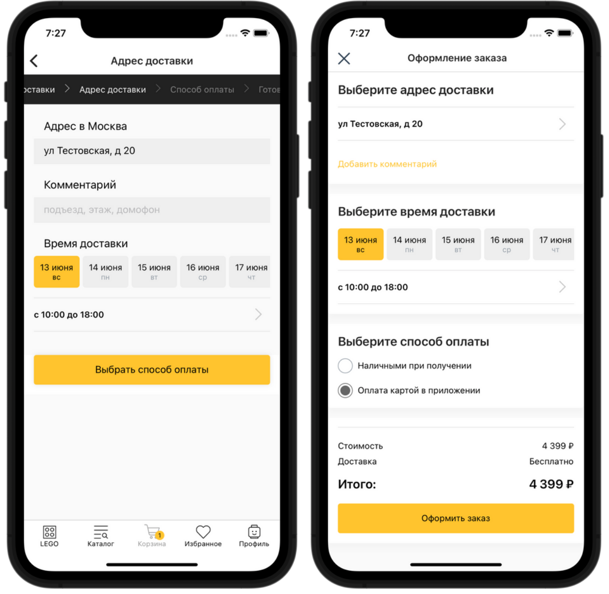

# Информация о пвз


**IMSHOP Retail Protocol (IRP)** является объектом интеллектуальной собственности ООО «АЙ ЭМ СОЛЮШНЗ» (IMSHOP) и защищён как объект авторского права. Свидетельство о депонировании произведения № 023-014461 от 16 января 2023 г. подтверждает исключительные права ООО «АЙ ЭМ СОЛЮШНЗ» на данные технологии.

IMSHOP Retail Protocol создан по заказу ООО «АЙ ЭМ СОЛЮШНЗ». Использование IMSHOP Retail Protocol допустимо только при взаимодействии с ООО "АЙ ЭМ СОЛЮШНЗ" и наличии действующего лицензионного договора. Более подробно можно ознакомиться [здесь](../../api-license.md).


## Запрос

### Описание формата

* **`locationId`** - str, id ПВЗ
* **`address`** - информация о локации пользователя
* **`deliveryId`** - идентификатор способа доставки
* **`items`** - arr, корзина
  * **`id`** - идентификатор товарного предложения товара
  * **`quantity`** - number, количество

### Пример запроса

```json
{
    "address":
    {
        "location":
        {
            "apt": null,
            "area": null,
            "areaFiasId": null,
            "areaKladrId": null,
            "areaWithType": null,
            "block": null,
            "city": "Москва",
            "cityFiasId": "0c5b2444-70a0-4932-980c-b4dc0d3f02b5",
            "cityKladrId": "7700000000000",
            "cityWithType": "г Москва",
            "federalDistrict": "Центральный",
            "fiasCode": "7700000000000000000",
            "fiasId": "0c5b2444-70a0-4932-980c-b4dc0d3f02b5",
            "house": null,
            "houseFiasId": null,
            "houseKladrId": null,
            "kladrId": "7700000000000",
            "lat": "55.75396",
            "lon": "37.620393",
            "postalCode": "101000",
            "region": "Москва",
            "regionFiasId": "0c5b2444-70a0-4932-980c-b4dc0d3f02b5",
            "regionKladrId": "7700000000000",
            "regionWithType": "г Москва",
            "settlement": null,
            "settlementFiasId": null,
            "settlementKladrId": null,
            "settlementWithType": null,
            "street": null,
            "streetFiasId": null,
            "streetKladrId": null,
            "streetType": null,
            "streetWithType": null,
            "valueAddress": null,
            "valueAddressFull": null,
            "valueCity": "Москва",
            "valueCityFull": "Москва"
        }
    },
    "items":
    [
        {
            "id": "29891",
            "quantity": 1
        }
    ],
    "locationId": "MSK582",
    "deliveryId": "d_123"
}
```

## Ответ

### Формата ответа

* **`pickupInfo`**
  * **`price`** - number, цена
  * **`address`** - string, адрес
  * **`priceDescription`** - string, текстовое описание стоимости доставки. Исползуется вместо price на экране информации о ПВЗ
  * **`lat`** - str, широта
  * **`lon`** - str, долгота
  * **`locationDescription`** - str, описание нахождения ПВЗ
  * **`title`** - str, название ПВЗ
  * **`deliveryTerm`** - str, срок доставки в свободной форме
  * **`timetable`** - str, расписание в свободной форме
  * **`images`** - str\[], URL изображений
  * **`items`** - Obj\[], **опциональное**, список товаров в ПВЗ&#x20;
    * **`id`** - str, **обязательное,** идентификатор товарного предложение (id из фида)
    * **`price`** - number, цена за штуку
    * **`quantity`** - number, **обязательное,** сколько покупатель сможет забрать в этом ПВЗ. не должен превышать `quantity` в запросе
    * **`preDiscountPrice`** - number, цена “до скидки” (перечеркнутая. если есть)

### Пример ответа

```javascript
"pickupInfo": {
    "price": 100,
    "address": "ул. Пушкина, дом 1",
    "priceDescription": "от 100 до 500 рублей",
    "lat": "55.654295",
    "lon": "37.578029",
    "locationDescription": "Обойти здание, за поворотом направо.",
    "title": "Пункт выдачи заказов №123",
    "locationId": "MSK123",
    "deliveryTerm": "от 3-х дней",
    "timetable": "пн-пт: 9:00–19:00, сб: 10:00–15:00",
    "images": [
      "https://image.com/image1.jpg",
      "https://image.com/image2.jpg",
      "https://image.com/image3.jpg"
    ],
    "items": [
      {
        "id": "31633501",
        "quantity": 1
      },
      {
        "id": "518710011",
        "price": 150,
        "preDiscountPrice": 200,
        "quantity": 0
      },
    ]
}
```

### Интервалы доставки

Если интервалы доставки не добавлены к способу доставки, то они могут отдаваться для тех пвз, где это актуально

<figure><figcaption><p>Выбор интервала доставки (слева — пошаговое оформление заказа, справа — на одной странице)</p></figcaption></figure>

**`dateIntervals`** — список доступных интервалов, привязанных к датам.

* **`id`** — идентификатор в вашей системе, число или строка.
*   **`title`** — название (конкретная дата), строка.

    **`subTitle`** — пояснение (день недели), строка.
* **`timeIntervals`** — список доступных интервалов, привязанных ко времени.
  * **`id`** — идентификатор в вашей системе, число или строка.
  * **`title`** — название (отрезок времени), строка.
  * **`price`** — (опционально) цена доставки в определенный интервал, число; используется в случае, когда таймслоты варьируются по стоимости (напр. вечерняя доставка - дороже).
