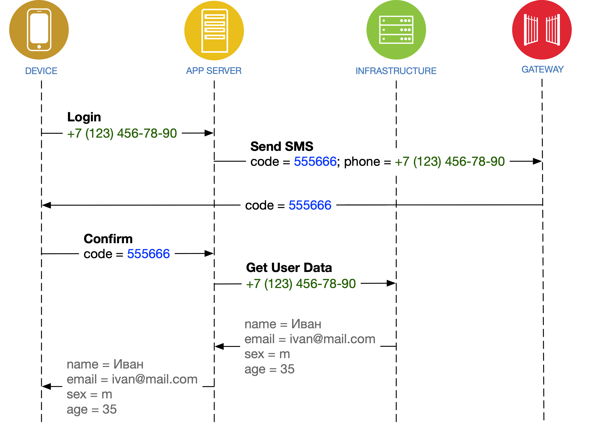

# Учётная запись пользователя. Авторизация.


Мы работаем только через **POST**-запросы



Дополнительные интеграции вводятся в эксплуатацию после завершения основных интеграций:

* [Оформление заказа](../../../osnovnye-integracii/oformlenie-zakaza.md)
* [Доставки](../../../osnovnye-integracii/dostavki.md)
* [Оплаты](../../../osnovnye-integracii/oplaty.md)

Для подключения дополнительных интеграций обратитесь к вашему менеджеру в IMSHOP.IO


## Авторизация


Для подключения авторизации и интеграций с программой лояльности обратитесь к вашему менеджеру в IMSHOP.IO


Пользователь мобильного приложения может быть авторизован и сопоставлен с пользователем в вашей системе.&#x20;

Мы можем идентифицировать пользователя, отправив ему одноразовый **пароль в SMS.**

В случае успешного подтверждения в мобильное приложение приходит базовая информация для оформления заказов (имя, телефон, адрес электропочты), и любая другая информация о человеке. Например, количество накопленных баллов в программе лояльности, или сегменты пользователя. Также появляется возможность синхронизировать [историю заказов ](../istoriya-zakazov.md)с, например, историей заказов на сайте.

<figure><figcaption>
Мобильное приложение, сервер IMSHOP.IO, ваша инфраструктура
</figcaption></figure>


**Регистрация**

IMSHOP.IO не поддерживает «классическую» регистрацию, когда человек вводит текст в кучу полей при помощи мелких кнопок экранной клавиатуры.

Мы не разделяем «регистрацию» и «авторизацию». В случае входа по SMS-сообщению вы получаете «живой», действующий номер телефона потенциального покупателя. Это — уже готовая учётная запись, в которой появится имя и прочая информация во время оформления заказа.


Если выбран вход посредством SMS или email-сообщения, существует два варианта реализации этой интеграции:

1. Отправка одноразового пароля — должна быть реализована с вашей стороны; вы сами интегрируетесь с SMS- шлюзом, а наша задача — [передать](avtorizaciya-po-nomeru-telefona-+-sms.md) вам номер телефона, а затем одноразовый пароль, который введёт пользователь
2. Отправка одноразового пароля — наша ответственность; мы сами удостоверимся, что пользователь является владельцем введенного номера телефона; от вас потребуются [только данные профиля](poluchenie-dannykh-uchyotnoi-zapisi.md#zapros-dannykh-polzovatelya-po-identifikatoru)

<figure><figcaption>
Сценарий 2: отправка одноразового пароля — наша ответственность
</figcaption></figure>

При любом сценарии дополнительно к аутентификации потребуется [метод получения данных пользователя](poluchenie-dannykh-uchyotnoi-zapisi.md#zapros-dannykh-polzovatelya-po-identifikatoru) («**Get User Data**» на диаграмме). Этот метод нужен для того, чтобы передать в мобильное приложение актуальную информацию в случае, когда пользователь отредактировал свою учётную запись вне приложения. Например, пользователь мог изменить имя через сайт, и требуется, чтобы это имя подтянулось в мобильное приложение.
