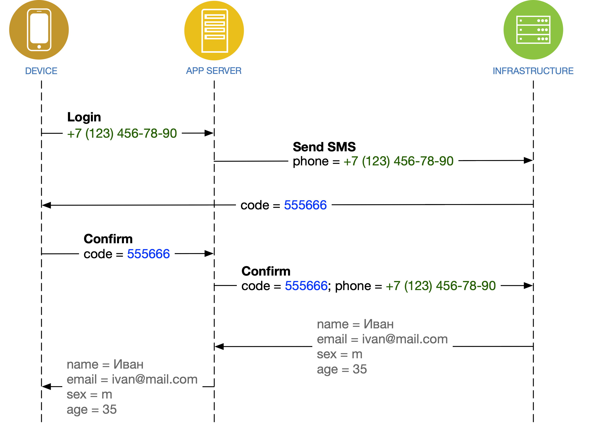

# Авторизация по номеру телефона + SMS


**IMSHOP Retail Protocol (IRP)** является объектом интеллектуальной собственности ООО «АЙ ЭМ СОЛЮШНЗ» (IMSHOP) и защищён как объект авторского права. Свидетельство о депонировании произведения № 023-014461 от 16 января 2023 г. подтверждает исключительные права ООО «АЙ ЭМ СОЛЮШНЗ» на данные технологии.

IMSHOP Retail Protocol создан по заказу ООО «АЙ ЭМ СОЛЮШНЗ». Использование IMSHOP Retail Protocol допустимо только при взаимодействии с ООО "АЙ ЭМ СОЛЮШНЗ" и наличии действующего лицензионного договора. Более подробно можно ознакомиться [здесь](../../../api-license.md).


<figure><figcaption></figcaption></figure>


**OTP** = one-time password, одноразовый пароль


«Золотой» сценарий:

1. Пользователь вводит номер телефона
2. Мобильное приложение отправляет запрос **OTP** в сервер IMSHOP.IO
3. Сервер IMSHOP.IO запрашивает отправку **OTP** в вашей инфраструктуре
4. Вы отправляете SMS, содержащее **OTP**
5. Пользователь вводит **OTP**
6. Мобильное приложение отправляет **OTP** в сервер IMSHOP.IO
7. Сервер IMSHOP.IO запрашивает подтверждение **OTP** в вашей инфраструктуре
8. Ваша инфраструктура подтверждает введенный **OTP**, а также возвращает данные пользователя&#x20;

## Запрос OTP

`APP SERVER → INFRASTRUCTURE`


От вас потребуется URL, на который наш сервер будет слать **POST**-запрос.


В вашу систему будут приходить вот такие данные:

```json
{
    "userIdentifier": "71234567890"
}
```

* **`userIdentifier`** — идентификатор пользователя (обязательное поле)

Идентификатор пользователя — это номер телефона или любой другой идентификатор (например, логин), как договоримся. В случае с номером телефона мы присылаем только цифры, через семёрку.

### Аккаунт существует

Если запрошенный аккаунт существует, вы должны отправить короткий код подтверждения на заданный номер телефона и ответить на запрос от IMSHOP в следующем формате:

**Ответ:**

```json
{
    "otp": {
        "timeout": 30,
        "attemptsLeft": 3,
        "message": "На номер +7 (965) ***-**-00 отправлено сообщение с кодом",
        "replyText": "Выслать код повторно",
        "codeLength": 4
    }
}
```

* **`timeout`** — сколько секунд осталось до возможности повторно запросить **OTP** (необязательное поле; по умолчанию 120 секунд)
* **`attemptsLeft`** — графический параметр для отображения сколько у юзеров осталось попыток. При передаче 0 кнопка отправки кода станет недоступна. (необязательное поле)
* **`message`** — сообщение для пользователя (обязательное поле)
* **`replyText`** — текст для кнопки повторного запроса **OPT** кода (необязательное поле)
* **`codeLength`** — длина **OTP** (необязательное поле; по умолчанию 4)


Номера телефонов стоит частично маскировать, но так, чтобы владелец номера всё равно мог понять, куда именно ему придёт SMS.


### **Регистрация**

Если данный номер телефона не зарегистрирован, вы можете **не отправлять код,** а сначала запросить дополнительные данные для регистраци.

Для этого необходимо ответить на запрос в следующем формате:

```javascript
{
    "dataRequired": ["email", "fullName"]
}
```

* **`dataRequired`** - список полей для запроса дополнительных данных\
  возможные значения:
  * **`email`** - e-mail
  * **`fullName`** - ФИО
  * **`birthday`** - день рождения
  * **`gender`** - пол
  * **`allowSms`** - запрос на разрешение отправки рекламных смс
  * **`allowEmail`** - запрос на разрешение отправки рекламных e-mail
  * **`allowMarketing`** - запрос на разрешение отправки рекламных акций (без уточнения канала)
  * **`referralCode`** - поле для реферального кода
  * **`legalEntities`** - возможность добавить юридическое лицо в профиль
* **`dataOptional`** - список необязательных для заполнения полей. Обратите внимание, что указанные в этом поле идентификаторы полей должны быть прописаны и в **`dataRequired`**

После сбора дополнительных данных, запрос на получение OTP будет повторен, но в запрос будут приложены все запрошенные данные. Пример:

```json
{
    "userIdentifier": "71234567890",
    "email": "some@mail.com",
    "fullName": "Николай Иванов",
    "birthday": "1980-01-31",
    "gender": "f"
}
```

В ответ на этот запрос вы должны прислать стандартный ответ на запрос OTP.

### Регистрация с юридическим лицом

При регистрации пользователя с юридическим лицом будут приходить такие же данные, как описано в предыдущем абзаце, к ним будет добавлен массив `legalEntities`, содержащий данные о юридическом лице (или о нескольких юридических лицах, если пользователь занес их в профиль до регистрации):

```json
{
    "userIdentifier": "71234567890",
    "email": "some@mail.com",
    "fullName": "Николай Иванов",
    "birthday": "1980-01-31",
    "gender": "f",
    "legalEntities": [
        {
            "businessAddress": "г Москва, ул. Тверская, 1",
            "contactPersonName": "Галина",
            "email": "test@test.io",
            "legalEntityName": "ООО \"ВЕКТОР\"",
            "phone": "+7 (900) 100-0000",
            "position": "Офис-менеджер",
            "taxRegistrationReasonCode": "771001001",
            "taxpayerIdentificationNumber": "7710010000"
        }
    ]
}
```

* **`businessAddress`** - юридический адрес юрлица
* **`contactPersonName`** - имя контактного лица
* **`email`** - email для связи
* **`legalEntityName`** - полное название юрлица
* **`phone`** - контактный телефон в формате +7 (900) 000-00-00
* **`position`** - должность контактного лица
* **`taxpayerIdentificationNumber`** - ИНН
* **`taxpayerRegistrationReasonCode`** - КПП

### **Ошибка: отправка OTP невозможна**

Возможно, SMS-шлюз не отзывается, либо вы по какой-то причине не хотите авторизовывать пользователя с таким идентификатором.

```json
{
    "error": {
        "message": "Превышено количество попыток входа"
    }
}
```

* **`message`** — сообщение для пользователя, описывающее проблему (обязательное поле)


Запрос нового **OTP** осуществляется посредством повторной отправки этого же запроса.


## Подтверждение OTP

`APP SERVER → INFRASTRUCTURE`


От вас потребуется URL, на который наш сервер будет слать **POST**-запрос.


В вашу систему будут приходить вот такие данные:

```json
{
    "userIdentifier": "71234567890",
    "otp": "555666"    
}
```

* **`userIdentifier`** — идентификатор пользователя (обязательное поле)
* **`otp`** — пароль, введенный пользователем (обязательное поле)

Чтобы **OTP** в SMS корректно воспринимался операционными системами iOS и Android, он должен содержать только цифры. Шесть штук. Такой формат позволит автоматически вставлять код из SMS одним нажатием. Если вы хотите другой формат — _сообщите нам заранее,_ нам необходимо будет заменить валидацию_._

**Ответ:**

```json
{
    "user": {
        "id": "123",
        "name": "Иванов Иван",
        "phone": "71234567890",
        "email": "ivanov@mail.com",
        "bonuses": 10000,
        "pendingBonusesTitle": "Будет накоплено",
        "pendingBonuses": 1000,
        "exressBonusesTitle": "Экспресс-бонусы",
        "expressBonuses": 500,
        "loyaltyProgram": {
            "currentLevelTitle": "Золотой уровень",
            "progress": 60,
            "profitDescription": "Cashback до 20% с каждой покупки",
            "nextLevelDescription": "Совершите покупку на 1000 рублей до уровня Платиновый",
            "backgroundColor": "gold",
            "progressBarColor": "black",
            "progressBarBackroundColor": "white",
            "textColor": "black"
        },
        "segments": ["registered", "loyal"],
        "age": 35,
        "gender": "male",
        "cardNumber": "456123789"
    }
}
```

— объект «[Учётная запись пользователя](broken-reference)». Обязательное поле:

* **`id`** — идентификатор пользователя в вашей системе


Идентификатор **`id`** пользователя необходим для других авторизованных запросов. Например, [получения истории](broken-reference).


В случае, если пользователь новый, и информации по нему никакой нет — допустимо присылать пустые поля (все, кроме **`id`**), или не присылать их вовсе. Любой ответ, не содержащий ключа **`error`**, будет расцениваться как успешный.

**Ошибка: подтверждение OTP не произошло**

Возможно, пользователь ввёл неправильные цифры. Возможно, на вашей стороне произошла какая-то другая ошибка. Возможно, вы передумали авторизовывать этого пользователя.

```json
{
    "error": {
        "message": "Неправильный код"
    }
}
```
