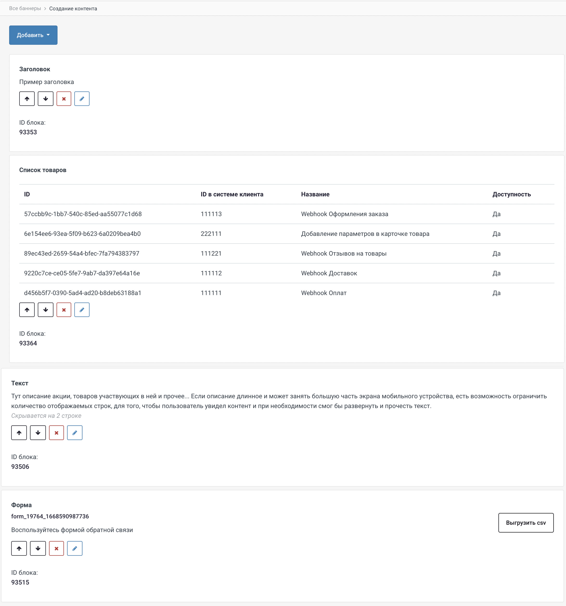
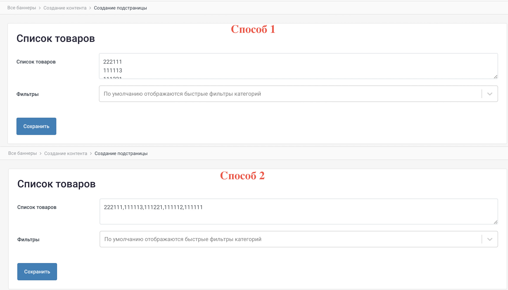
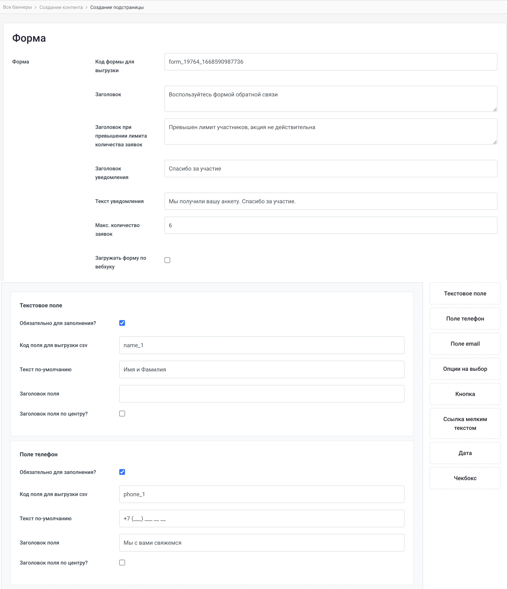
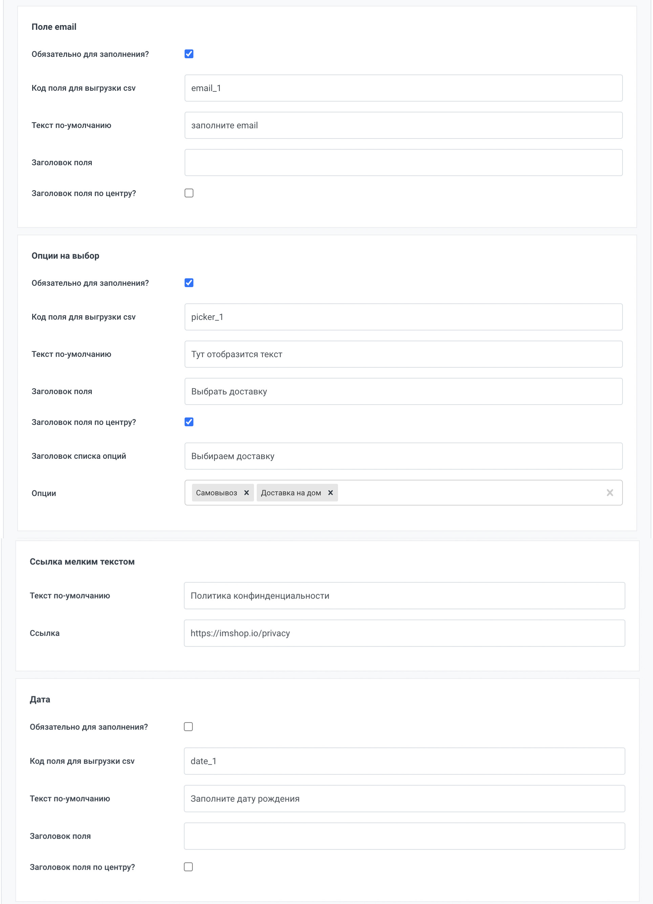
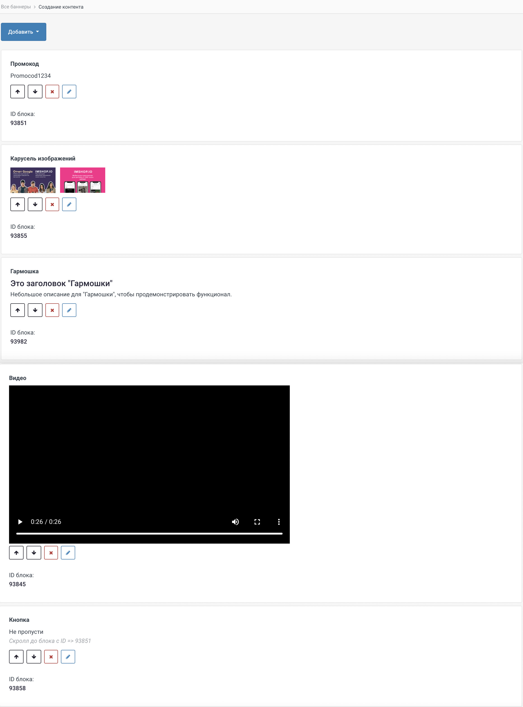

# Создание контента внутри баннера (subtoday)

Если в баннере **не добавлен deeplink** его можно заполнить вручную, для этого пролистываем экран создания баннера вниз и нажимаем кнопку **"Добавить экран с контентом"** **(screen 1).**

<figure><figcaption>
<strong>(screen 1)</strong>
</figcaption></figure>

Мы попадаем на пустой экран с единственной кнопкой **"Добавить"**, при нажатии на нее выпадает меню контентного наполнения **(screen 2).**

<figure><figcaption>
<strong>(screen 2)</strong>
</figcaption></figure>

* Чтобы добавить заголовок, нажимаем кнопку **"Добавить заголовок"** и заполняем поле **(video 1)**.&#x20;


Обратите внимание, что **подзаголовок** отображается **крупнее заголовка**, наглядно ниже на **(video 3)**



&#x20;**(video 1)**


* Рассмотрим как добавить основное изображение внутри баннера. Для этого снова нажимаем кнопку **"Добавить"** и выбрать пункт **"Добавить изображение" (video 2).**


**(video 2)**


* Далее **добавим товары**, подходящие под условия акции (не более 20). Товары записываем в столбик как на **(screen 3)**, или через запятую

<figure><figcaption>
<strong>(screen 3)</strong> <strong></strong>
</figcaption></figure>

Пример наполненного баннера с вышеуказанными полями **(video 3).**


Кнопку **"В корзину" можно отключить/включить для всех баннеров**, для этого обратитесь к product менеджеру imshop.



**(video 3)**


### Добавляем Заголовок, Список товаров, Параграф и Форму

<figure><figcaption>
<strong>(screen 4)</strong>
</figcaption></figure>

* Чтобы добавить **"Список товаров"**, выбираем соответствующий пункт меню и вписываем коды товаров в столбик или через запятую **(screen 5)**.

<figure><figcaption>
<strong>(screen 5)</strong>
</figcaption></figure>

* Добавляя **"Параграф"**, если он длинный, заполняем через какое количество строк он будет свернут **(screen 6)**. Наглядно на **(video 4)**.

<figure><figcaption>
<strong>(screen 6)</strong>
</figcaption></figure>

* Добавляем **"Форму"** обратной связи, на **(screen 7,8,9)** мы рассмотрим пример заполнения всех полей формы, создаваемой вручную.
  * Если в вашем приложении реализован [**webhook Форм**](../../../dopolnitelnye-integracii/vitrina-poisk/formy.md), то заполняем только первую часть, не добавляя кнопок. **Обязательно** указывается корректный **Код формы для выгрузки** проставляется галочка **Загружать форму по вебхуку**.

<figure><figcaption>
<strong>(screen 7)</strong>
</figcaption></figure>

<figure><figcaption>
<strong>(screen 8)</strong>
</figcaption></figure>

<figure><figcaption>
<strong>(screen 9)</strong>
</figcaption></figure>


**(video 4)**


### Добавляем Промокод, Карусель изображений, гармошку, Видео, Кнопку

<figure><figcaption>
<strong>(screen 10)</strong>
</figcaption></figure>

* Выбираем пункт **"Промокод"** и заполняем текстовое поле промокодом, **который считывается в вашей базе**.

<figure><figcaption>
<strong>(screen 11)</strong>
</figcaption></figure>

* Для добавления **"Карусели изображений"** в текстовое поле вставляем URL на изображение в столбик **(screen 12)**.

<figure><figcaption>
<strong>(screen 12)</strong>
</figcaption></figure>

* Пункт **"Гармошка"** - это текстовое описание предложения, где изначально отображается только заголовок. При желании пользователь может развернуть полное описание. Пример отображения в приложении **(video 5)**.

<figure><figcaption>
<strong>(screen 13)</strong>
</figcaption></figure>

* Добавляем **"Видео"**. Видео **с высоким разрешением могут загружаться дольше!**
  * Ссылка на видео может быть с youtube или в формате MP4. Чтобы **видео проигрывалось автоматически** при входе в баннер **обязательна ссылка** на видео MP4 **(не youtube)**.
  * Ссылка на постер к видео не обязательный пункт, но дает возможность выбрать необходимую для вас заставку видео
  * Галочка **проигрывать автоматически** позволяет проигрывать видео при входе на баннер **(работает только для ссылок на прямое MP4)**

<figure><figcaption>
<strong>(screen 14)</strong>
</figcaption></figure>

*   Добавляем **"Кнопку"**

    * Название кнопки должно быть коротким (желательно одно слово).
    * Deeplink необязательное поле, позволяет отправить на [подборку товаров](../konstruktor-ssylok-sozdanie-deeplink/).
    * Если "Прикрепить кнопку к низу экрана", она будет всегда отображаться в нижней части экрана, вне зависимости от количества контента
    * **"По нажатию, скроллить до блока"** позволяет по нажатию "Кнопки" отматывать баннер до определенного блока. На **(screen 16)** можно посмотреть где получить **ID блока**.

<figure><figcaption>
<strong>(screen 15)</strong>
</figcaption></figure>

<figure><figcaption>
<strong>(screen 16)</strong>
</figcaption></figure>


&#x20;**(video 5)**


### Добавляем Таббар

* Заполняем заголовок каждого Таба, и в столбик заполняется ID блоков **(screen 17)**.

<figure><figcaption>
<strong>(screen 17)</strong>
</figcaption></figure>


**(video 6)**

