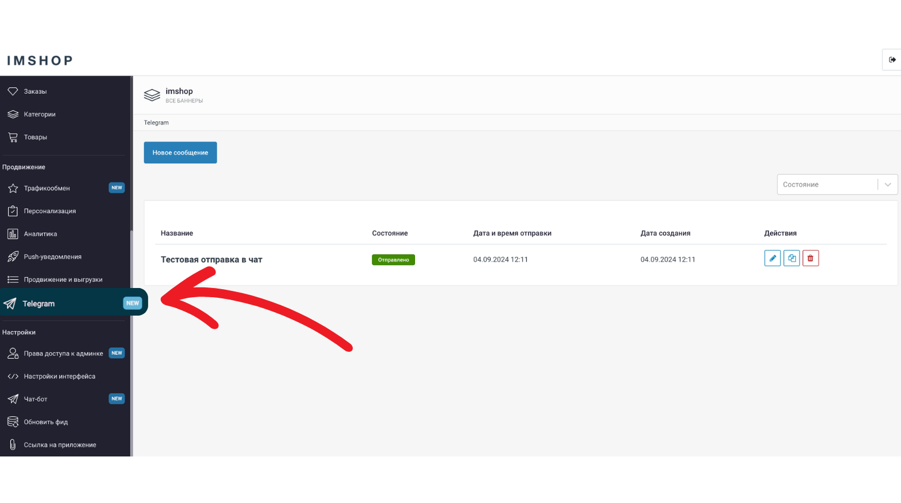

# Telegram-модуль


**IMSHOP Retail Protocol (IRP)** является объектом интеллектуальной собственности ООО «АЙ ЭМ СОЛЮШНЗ» (IMSHOP) и защищён как объект авторского права. Свидетельство о депонировании произведения № 023-014461 от 16 января 2023 г. подтверждает исключительные права ООО «АЙ ЭМ СОЛЮШНЗ» на данные технологии.

IMSHOP Retail Protocol создан по заказу ООО «АЙ ЭМ СОЛЮШНЗ». Использование IMSHOP Retail Protocol допустимо только при взаимодействии с ООО "АЙ ЭМ СОЛЮШНЗ" и наличии действующего лицензионного договора. Более подробно можно ознакомиться [здесь](../../api-license.md).



Telegram-модуль — это приложение внутри Telegram, которое помогает повысить конверсию в заказы. С его помощью можно создавать удобные подборки товаров и отправлять их подписчикам вашего Telegram-канала. Пользователи смогут оформить заказ прямо в телеграме, не выходя из него, всего в пару кликов. Все процессы автоматизированы и интегрированы через действующие интеграции.



Для подключения телеграм-модуля к вашему каналу свяжитесь с вашим Product-менеджером


Чтобы начать управление модулем, необходимо перейти в Telegram в разделе "Продвижение"  **(screen 1).**

<figure><figcaption>
screen 1
</figcaption></figure>

Далее увидим список ранее отправленных постов (если были), а также кнопку "Новое сообщение" **(screen 2)**

<figure><figcaption>
screen 2
</figcaption></figure>

Нажав на кнопку "Новое сообщение" мы увидим поля, которые необходимо заполнить для отправки поста в ваш канал **(screen 3)**. Список полей и их значение:

* Название - используется для вашего личного обозначения постов (пример в screen 2), не будет публиковаться в посте
* Тип поста - доступно 4 типа поста (товар, диплинк, категория/весь каталог, подборка (конкретный список товаров)
* Текст на кнопке - название кнопки, которую будут видеть подписчики вашего канала в отправленном посте
* Текст сообщения - содержание поста (есть поддержка емодзи)
* Ссылка на изображение&#x20;

<figure><figcaption>
screen 3
</figcaption></figure>

#### Тип поста - товар

Для отправки поста с диплинком на конкретный товар необходимо выбрать тип поста - товар, а также указать ID товара из фида (который можно взять из раздела "Товары"), указываем текст поста, ссылку на картинку и выбираем время отправки - сейчас или в определенное время в будущем.  Пример заполненных полей в админке, а также результат, который увидят пользователи нажав в телеграмме доступен в **screen 4**

<figure><figcaption>
screen 4
</figcaption></figure>

#### Тип поста - диплинк

Для отправки поста с диплинком на конкретный товар необходимо выбрать тип поста - диплинк, далее указать deeplink, который вы сформируете в конструктуре диплинков,  текст поста, ссылку на картинку и выбираем время отправки - сейчас или в определенное время в будущем.  Пример заполненных полей в админке, а также результат, который увидят пользователи нажав в телеграмме доступен в **screen 5**

<figure><figcaption>
screen 5
</figcaption></figure>

#### Тип поста - категория или весь каталог

Для отправки поста на весь каталог или на конкретную категорию необходимо выбрать соответствующий тип поста, далее указать ID категории (можно взять из раздела "Категории"),  текст поста, ссылку на картинку и выбираем время отправки - сейчас или в определенное время в будущем.  Пример заполненных полей в админке, а также результат, который увидят пользователи нажав в телеграмме доступен в **screen 6**

<figure><figcaption>
screen 6
</figcaption></figure>

#### Тип поста - подборка

Для отправки поста на конкретную товарную подборку необходимо выбрать соответствующий тип поста, далее указать ID товаров через пробел или запятую **(максимум 20)**,  текст поста, ссылку на картинку и выбираем время отправки - сейчас или в определенное время в будущем.  Пример заполненных полей в админке, а также результат, который увидят пользователи нажав в телеграмме доступен в **screen 7**

<figure><figcaption>
screen 7
</figcaption></figure>
