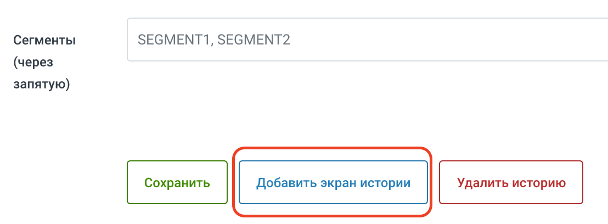
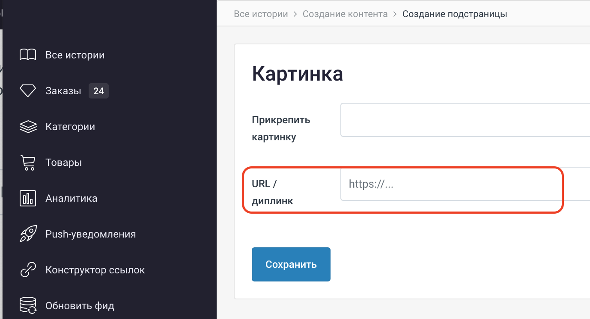

# Создание диплинков

На что делаем диплинк \(доступные страницы приложения, куда осуществляется переход\)

## На экран истории

Ведёт на один из блоков контента главной вкладки. Требуется ввод ID, берётся из URL админки, открыв блок на редактирование. Например [https://console.imshop.io/\*\*\*/stories/](https://console.imshop.io/***/stories/15)[**15**](https://console.imshop.io/***/stories/15)

**Внимание:** экран истории, помимо фиксированного текстового наполнения, может вести на какой-либо раздел приложения. Для этого необходимо заполнить поле "URL / диплинк"

Кроме того, **элементы истории** также могут содержать диплинк: необходимо нажать "Добавить экран истории", в меню выбрать "Добавить картинку" и при её редактировании заполнить "URL / диплинк"

## На экран с категориями, но **без** товаров, согласно фиду

### Параметры:

**Заголовок экрана \(текст\):** будет отображаться в шапке

**ID категории из API:** берётся из админки [https://console.imshop.io/account/\*\*\*/categories](https://console.imshop.io/account/lego/categories)

## На экран с категориями **и** товарами, согласно фиду

### Параметры:

Те же, что выше

## На экран с товарами \(без категорий\), согласно фиду

### Параметры:

Те же, что выше

## На товар

### Параметры:

**ID товара из фида:** берётся из админки [https://console.imshop.io/account/\*\*\*/items](https://console.imshop.io/account/***/items)

## Умный диплинк из главного экрана на выборку товаров, с учетом фильтров, сортировок и поиска \(для главной\)

### Параметры:

**ID категории из API:** см. выше

**Название подборки:** будет отображаться в шапке

**Поисковый запрос** \(не обязательно\): строка для поиска по тексту, например, название товара

**Применить фильтры по параметрам из фида:** нажать \[+\], можно задать фильтрацию по нескольким параметрам товара одновременно.

Системные фильтры, их наличие не зависит от данных, переданных в фиде:

• Бренд – **q\_vendor**, в префикс+название. В поле значение введите название бренда

• Товар со скидкой – **q\_discounted**, в префикс+название. В поле значение введите **true**, чтобы показать только товары со скидкой

• Диапазон цен – **q\_price**, в префикс+название. В поле значение введите желаемый диапазон в рублях

Произвольные фильтры, которые строятся из параметров товара:

Примеры:

• **f\_Цвет** значение **Жёлтый** \(если необходимо отобрать по нескольким значениям, требуется добавить ещё одно значение рядом\)

• **f\_Пол** значение **Женский**

## Умный диплинк из каталога на выборку товаров, с учетом фильтров, сортировок и поиска \(для Push-уведомлений\)

### Параметры:

Те же, что выше

