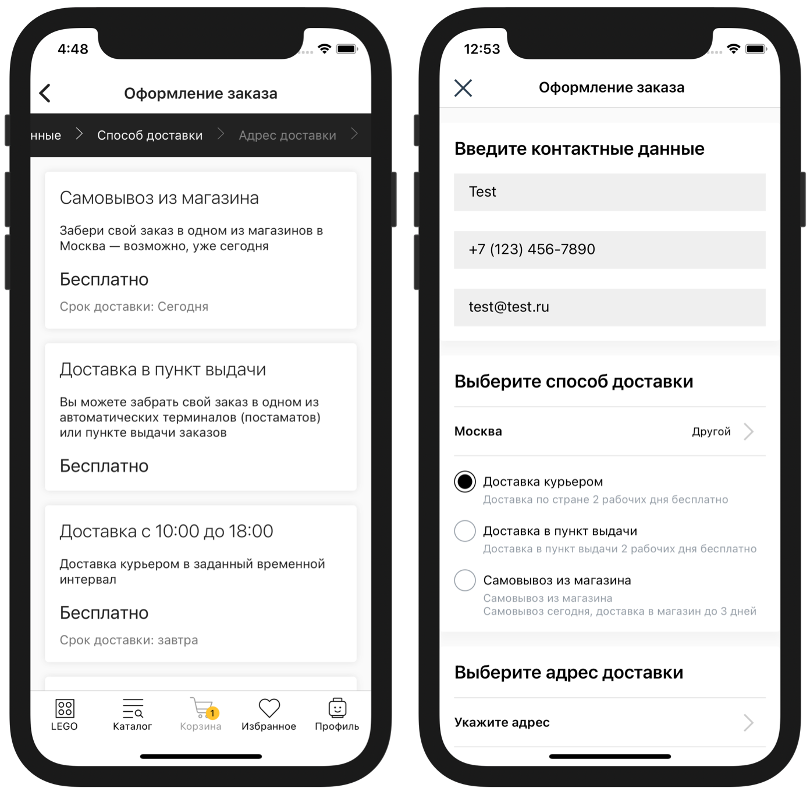

# Доставки


**IMSHOP Retail Protocol (IRP)** является объектом интеллектуальной собственности ООО «АЙ ЭМ СОЛЮШНЗ» (IMSHOP) и защищён как объект авторского права. Свидетельство о депонировании произведения № 023-014461 от 16 января 2023 г. подтверждает исключительные права ООО «АЙ ЭМ СОЛЮШНЗ» на данные технологии.

IMSHOP Retail Protocol создан по заказу ООО «АЙ ЭМ СОЛЮШНЗ». Использование IMSHOP Retail Protocol допустимо только при взаимодействии с ООО "АЙ ЭМ СОЛЮШНЗ" и наличии действующего лицензионного договора. Более подробно можно ознакомиться [здесь](../api-license.md).



Обратите внимание, что цены в webhook доставки не передаются. При необходимости подсчетов ориентируйтесь на **ваши идентификаторы товара**.


<figure><figcaption><p>Выбор способа доставки (слева — пошаговое оформление заказа, справа — на одной странице)</p></figcaption></figure>


Для подключения ендпоинта доставок обратитесь к вашему менеджеру в IMSHOP.IO


IMSHOP.IO передаёт состав корзины, город (и страну), а также промокод и идентификатор пользователя, если они есть; в ответ IMSHOP.IO ожидает список доступных способов доставки.


Этот запрос отправляется не только в тех случаях, когда список доставок нужно вывести пользователю. Список доставок также нужен (повторно) перед финальным запросом оформления заказа.


## Формат запроса и пример

### Пример

**`POST`**`https://api-imshop.store.ru/v1/deliveries`

```json
{
    "externalUserId": "XXXXXX",
    "country": "RU",
    "hasPreorderItems": true,
    "promocode": null,
    "bonusesSpent": 123,
    "position": "checkout",
    "legalEntityMode": true,
    "addressData": {
        "apt": null,
        "area": null,
        "areaFias": null,
        "areaKladr": null,
        "building": null,
        "city": "Омск",
        "cityFias": "140e31da-27bf-4519-9ea0-6185d681d44e",
        "cityKladr": "5500000100000",
        "city_kladr": "5500000100000",
        "fias": "140e31da-27bf-4519-9ea0-6185d681d44e",
        "fiasCode": "55000001000000000000000",
        "fias_code": "55000001000000000000000",
        "fias_id": "140e31da-27bf-4519-9ea0-6185d681d44e",
        "house": null,
        "houseFias": null,
        "houseKladr": null,
        "kladr": "5500000100000",
        "lat": "54.98",
        "lon": "73.36",
        "region": "Омская",
        "regionFias": "05426864-466d-41a3-82c4-11e61cdc98ce",
        "regionKladr": "5500000000000",
        "settlement": null,
        "settlementFias": null,
        "settlementKladr": null,
        "settlementWithType": null,
        "street": null,
        "streetFias": null,
        "streetKladr": null,
        "value": "г Омск",
        "zip": "644000"
    },
    "items": [
        {
            "name": "Тестовый товар 1",
            "id": "3677482",
            "privateId": "3677483",
            "configurationId": "3677483",
            "quantity": 1
        },
        {
            "name": "Тестовый товар 2",
            "id": "6237828",
            "privateId": "6237830",
            "configurationId": "6237830",
            "quantity": 1
        }
    ]
}
```


### Описание формата

* **`externalUserId`** — идентификатор покупателя на стороне клиента, если тот авторизован в мобильном приложении, **`null`** по умолчанию
* **`country`** — ISO код страны, **`RU`**
* **`bonusesSpent`** - списанные бонусы
* **`hasPreorderItems`** —  в случае если в запросе товары с предзаказом
* **`promocode`** — прикрепленный промокод, **`null`** по умолчанию
* **`position`** —  источник вызова, (checkout, deliveryWidget), можно использовать для определения источника запроса (чекаут или карточка товара) и передавать в карточку товара уменьшенную выборку или отсортировав по другому
* **`skipPickupLocations`** — если этот параметр передан, и он равен **`true`**, то в ответе достаточно передать только способ самовывоза, и не передавать все доступные точки получения заказа
* **`legalEntityMode`** – передается и имеет значение `true`, если при оформлении заказа выбрано юридическое лицо
* **`items`** - список товаров в корзине
  * **`id`** — идентификатор товара в системе клиента (**`group_id`** из фида)
  * **`configurationId`** — идентификатор товарного предложения в системе клиента (идентификатор **`id`** из фида)
  * **`privateId`** — идентификатор товарного предложения в системе клиента (идентификатор **`id`** из фида)
  * **`quantity`** — количество&#x20;
* **`addressData`** — полная информация о адресе, прошедшая валидацию [DaData ](https://dadata.ru/)
  * **`kladr`** — [Классификатор адресов Российской Федерации](https://www.alta.ru/fias/), определяющий  город и улицу
  * **`apt`**— номер квартиры
  * **`houseKladr`**— **не ориентируйтесь на это поле** [Классификатор адресов Российской Федерации](https://www.alta.ru/fias/), определяющий конкретный дом, по умолчанию **`null`**, ситуативно [DaData ](https://dadata.ru/)может передавать данное поле заполненным
  * **`region`**— регион
  * **`fias`**— [ФИАС](https://www.alta.ru/fias) города и улицы
  * **`value`**— адрес полностью
  * **`cityFias`**— [ФИАС](https://www.alta.ru/fias) города&#x20;
  * **`areaFias`** — [ФИАС](https://www.alta.ru/fias)-код района
  * **`streetKladr`**— [Классификатор адресов Российской Федерации](https://www.alta.ru/fias/), определяющий  улицу
  * **`regionKladr`**— [Классификатор адресов Российской Федерации](https://www.alta.ru/fias/), определяющий регион
  * **`regionFias`**— [ФИАС](https://www.alta.ru/fias) определяющий регион
  * **`city_kladr`**— [Классификатор адресов Российской Федерации](https://www.alta.ru/fias/), определяющий город
  * **`streetFias`**— [ФИАС](https://www.alta.ru/fias) определяющий улицу
  * **`zip`**— индекс дома
  * **`settlement`** — населенный пункт
  * **`settlementFias`** — [ФИАС](https://www.alta.ru/fias)-код населенного пункта
  * **`beltwayDistance`** — расстояние от кольцевой в км (только если заполнен **`beltwayHit`**)
  * **`lat`**— широта&#x20;
  * **`lon`**— долгота
  * **`settlementKladr`** — [Классификатор адресов Российской Федерации](https://www.alta.ru/fias/), определяющий населенный пункт
  * **`house`**— номер дома
  * **`city`**— название города
  * **`cityKladr`**— [Классификатор адресов Российской Федерации](https://www.alta.ru/fias/), определяющий город
  * **`houseFias`**— **не ориентируйтесь на это поле** [ФИАС](https://www.alta.ru/fias), определяющий конкретный дом, по умолчанию **`null`**, ситуативно [DaData ](https://dadata.ru/)может передавать данное поле заполненным
  * **`beltwayHit`** — внутри кольцевой ( I&#x4E;_&#x4D;KAD - на территории МКАД, OUT\__&#x4D;KAD - за территорией МКАД)
  * **`area`** — район в регионе
  * **`fias_code`** — не заполняется, используйте **`fias_id`**
  * **`street`**— название улицы
  * **`areaKladr`** — [Классификатор адресов Российской Федерации](https://www.alta.ru/fias/), определяющий район
  * **`settlementWithType`** — улица с типом
  * **`fias_id`** — [ФИАС](https://www.alta.ru/fias)-код адреса (идентификатор адреса)

### Маркетинговые акции, активированные в корзине

**Ритейлер** имеет возможность предложить альтернативные условия: отключение бесплатной доставки из-за применённой скидки, смена сроков доставки из-за усложнения логистики с подарками и т.д.


Доп. поле **`promoGroup`** передаётся в запрос списка доставок. Описание формата приведено в разделе [Список "Маркетинговые акции"](../dopolnitelnye-integracii/korzina-oformlenie-zakaza/raschet-korziny-skidok-ballov/spisok-marketingovye-akcii.md#format-zaprosa-posle-vybora-akcii)



Для маркетплейсов.

В полях запроса для каждого товара могут быть переданы идентификаторы магазина/ООО (**в разработке**).


* **`warehouseId`** — (опционально) идентификатор склада/магазина/аутлета/ООО из [<mark style="color:purple;">фида наличия для маркетплейсов</mark>](broken-reference)<mark style="color:purple;">.</mark>

```json
{    
    ...
    "items": [
        {
            ...
            "warehouseId": "AF-1416"
            ....
        }
    ]
    ...
}
```



В запросе может приходить гораздо больше информации. Например, для товаров могут приходить названия.

Дополнительные поля могут облегчить процесс отладки, но не являются частью спецификации, на них нельзя базировать программную логику.


## Формат ответа и пример


Если в ответе не будут отданы ВСЕ :exclamation:**обязательные поля** - в приложении не отобразятся доставки


### Описание формата

* **`deliveries`** — список доступных способов доставки, массив
  * :exclamation:**`id`** — идентификатор, строка **(обязательное поле)**
  * :exclamation:**`title`** — название, строка **(обязательное поле)**
  * **`description`** — описание, строка
  * :exclamation:**`type`** — тип (**`delivery`**, **`pickup`** — доставка или самовывоз) **(обязательное поле)**
  * :exclamation:**`hasPickupLocations`** — способ доставки требует выбора пункта самовывоза (особенно важно при ответе на запросы со **`skipPickupLocations`** = **`true`**) **(обязательное поле)**
  * :exclamation:**`price`** — минимальная цена, цифра **(обязательное поле)**
  * **`priceLabel`** — цена в свободной форме; строка; приоритетнее поля `price`
  * :exclamation:**`min`** — минимальный срок доставки (**`0`** - сегодня, **`1`** - завтра, **`2`**-послезавтра, **`3`**- от 3 дней) **(обязательное поле)**
  * **`max`** — максимальный срок доставки (**`0`** - сегодня, **`1`** - завтра итд)
  * **`timeLabel`** — время доставки в виде текста (отображается на экране выбора способа доставки)
  * **`addressNotice`** — (**опциональное** поле, только для доставок type: delivery) сообщение которое будет выведено рядом с блоком адреса (Например, что адрес не входит в область доставка)
  * **`locations`** — список ПВЗ (если **`type`** = **`pickup`** и требуется выбор пункта самовывоза, и в запросе не передан **`skipPickupLocations`** = **`true`**)
    * :exclamation:**`id`** — идентификатор самовывоза, строка **(обязательное поле)**
    * :exclamation:**`title`** — название, строка **(обязательное поле)**
    * :exclamation:**`address`** — адрес, строка **(обязательное поле)**
    * :exclamation:**`city`** — город, строка **(обязательное поле)**
    * **`time`** — расписание / время работы, строка
    * **`subway`** — ближайшая станция метро, строка
    * **`mall`** — название ТЦ, если не указывается в поле **`title`**
    * :exclamation:**`lat`** — широта для отображения на карте, строка **(обязательное поле)**
    * :exclamation:**`lon`** — долгота для отображения на карте, строка **(обязательное поле)**
    * :exclamation:**`price`** — цена доставки в этот ПВЗ, цифра **(обязательное поле)**
    * :exclamation:**`min`** — ожидаемое время доставки (**`0`** - сегодня), цифра **(обязательное поле)**
    * **`timeLabel`** — время доставки в виде текста (отображается на экране выбора пункта получения заказа и на экране описания пункта самовывоза), строка
    * **`notice`** - (в разработке) опционально, выделенный текстовый блок, например, чтобы уведомить покупателя, что не все товары доступны в данном ПВЗ
    * **`tags`** — список тэгов у ПВЗ. Можно использовать тип пункта (пункт выдачи, постомат и т.д.), так и наименования (СДЭК, Boxberry, 5post)
    * **`mapIcon`** — кастомная иконка пункта выдачи
    * **`infoTags`** — информационные теги, например: "Только по паспорту" и т.п.
      * :exclamation:**`title`** — название тега
      * **`modal`** — (опционально) активируется возможность нажать на тег чтобы открыть модалку с пояснением.
        * :exclamation:**`title`** — заголовок
        * :exclamation:**`description`** — описание/пояснение
  * **`groupName`** — (опционально) идентификатор для группировки, строка (способы доставки, у которых значение группы совпадает, схлопываются в один пункт; после его выбора, пользователь увидит все пункты, входящие в эту группу)
  * **`addressIsOptional`** — (опционально) при значении `true` в приложении появляется возможность пропустить ввод адреса для курьерской доставки

### Пример

```javascript
{
    "deliveries": [
        {
            "id": "regular",
            "title": "Доставка курьером",
            "hasPickupLocations": false,
            "description": "Доставка курьерской службой по города на следующий день",
            "type": "delivery",
            "price": 350,
            "min": 1,
            "timeLabel": "На следующий день",
            "addressIsOptional": true
        },
        {
            "id": "pickup",
            "title": "Самовывоз из магазина",
            "hasPickupLocations": true,            
            "description": "Самовывоз заказа из магазина в день заказа",
            "type": "pickup",
            "price": 0,
            "min": 0,
            "timeLabel": "В день заказа",
            "locations": [
              {
                "id": "a0001",
                "title": "Гидропроект",
                "address": "Волоколамское шоссе 2",
                "city": "Москва",
                "time": "Каждый день с 10 до 22",
                "subway": "Сокол",
                "mall": "",
                "lat": "55.8078034",
                "lon": "37.5054127",
                "price": 0,
                "min": 0,
                "timeLabel": "Сегодня после 14:00",
                "infoTags": [
                  {
                    title: "Вручение только по паспорту",
                    modal: {
                      title: "Заголовок",
                      description: "Описание/пояснение"
                    }
                  }
                ]
            }
          ]
        },
        {
            "id": "regular",
            "title": "Экспресс доставка",
            "hasPickupLocations": false,
            "description": "Доставка курьерской службой по города на следующий день",
            "type": "delivery",
            "price": 350,
            "min": 1,
            "timeLabel": "На следующий день",
            "addressNotice": "Ваш адрес не входит в зону экспресс доставки",
            "addressNoticeColor": "#CC0000"
        },
    ]
}
```

### Кастомное сообщение если доставка недоступна

**message** - (опционально) текст который вы хотите отобразить юзеру если доставка недоступна&#x20;

```json
{
"deliveries":[],
"message": "Заказ недоступен в этом регионе"
}
```

### Интервалы доставки

<figure><figcaption><p>Выбор интервала доставки (слева — пошаговое оформление заказа, справа — на одной странице)</p></figcaption></figure>

Могут быть добавлены в любой из элементов списка доставок, имеющих тип **`delivery`**

* **`dateIntervals`** — список доступных интервалов, привязанных к датам.
  * **`id`** — идентификатор в вашей системе, число или строка.
  *   **`title`** — название (конкретная дата), строка.

      **`subTitle`** — пояснение (день недели), строка.
  * **`timeIntervals`** — список доступных интервалов, привязанных ко времени.
    * **`id`** — идентификатор в вашей системе, число или строка.
    * **`title`** — название (отрезок времени), строка.
    * **`price`** — (опционально) цена доставки в определенный интервал, число; используется в случае, когда таймслоты варьируются по стоимости (напр. вечерняя доставка - дороже).

### Фильтрация точек получения

<figure><figcaption><p>Фильтры на карте точек самовывоза</p></figcaption></figure>

Для отображения фильтров, у каждого пункта выдачи (в списке locations) необходимо передать список тэгов (tags)

**`tags`** — список тэгов у ПВЗ. Можно использовать тип пункта (пункт выдачи, постомат и т.д.), так и наименования (СДЭК, Boxberry, 5post)

#### Пример:

```
{
    "deliveries": [
        {
            "id": "pickup",
            "title": "Самовывоз из магазина",
            "hasPickupLocations": true,            
            "description": "Самовывоз заказа из магазина в день заказа",
            "type": "pickup",
            "price": 0,
            "min": 0,
            "timeLabel": "В день заказа",
            "locations": [
              {
                "id": "a0001",
                "title": "Гидропроект",
                "address": "Волоколамское шоссе 2",
                "city": "Москва",
                "time": "Каждый день с 10 до 22",
                "subway": "Сокол",
                "mall": "",
                "lat": "55.8078034",
                "lon": "37.5054127",
                "price": 0,
                "min": 0,
                "timeLabel": "Сегодня после 14:00",
                "tags": ["ПВЗ", "СДЭК"]
            }
          ]
        }
    ]
}
```
