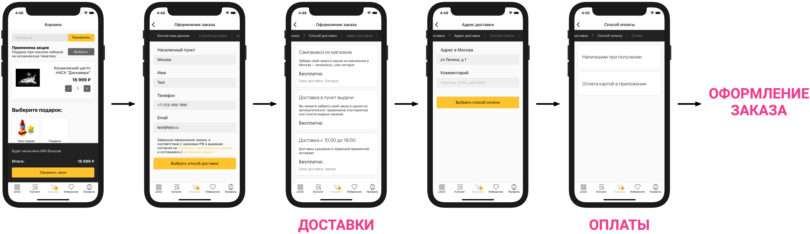

# Оформление заказа


Мы работаем только через **POST**-запросы


<figure><figcaption></figcaption></figure>


Для подключения вебхука передачи заказа обратитесь к вашему менеджеру в IMSHOP.IO. Передайте менеджеру URL.


IMSHOP.IO передаёт состав корзины, полный адрес, идентификаторы выбранных способов оплаты и доставки, а также промокод и идентификатор пользователя, если они есть; в ответ IMSHOP.IO ожидает отбивку об удачно зарегистрированном заказе.


**Вебхук оформления заказа обязан быть максимально толерантным ко входящим данным.**

Местоположение пользователя, email, номер телефона, имя и пр. данные проходят валидацию на стороне IMSHOP.IO.&#x20;

Есть вероятность, что проверки на корректность на вашей стороне предъявляют больше требований. Например, имя пользователя обязательно должно начинаться с большой буквы.&#x20;

Следует помнить, что если в запросе присутствуют некорректные данные — их всегда можно уточнить на этапе подтверждения заказа по телефону.

Если заказ с некорректными данными не был принят — это уже потерянные деньги.


## Формат запроса и пример

### Пример

**`POST`**`https://api-imshop.store.ru/v1/orders`

```json
{
    "device": {
        "platform": "ios"
    },
    "installId": "9e201bab-1ccf-47d1-82e0-90d71ee5fd2c",
    "orders": [{
        "uuid": "2d81f6e5-01cb-44ca-abb0-ded88c1fc982",
        "externalUserId": "XXXXXX",
        "hasPreorderItems": true,
        "groupId": "2d81f6e5-01cb-44ca-abb0-ded88c1fc982",
        "createdOn": "2018-10-15 12:54:18.356089",
        "updatedOn": "2018-10-15 12:54:18.356089",
        "status": "placed",
        "name": "Дмитрий",
        "phone": "+7 (999) 999-9999",
        "email": "some@mail.com",
        "anotherRecipientData": {
            "name": "Галина",
            "phone": "+7 (999) 999-9999"
        },
        "country": "RU",
        "city": "Москва",
        "address": "ул Тестовая, д 1",
        "addressData": {
            "city": "Москва",
            "region": "Москва",
            "street": "Тестовая",
            "house": "1",
            "building": null,
            "apt": null,
            "zip": "127001",
            "kladr": "7700000000000",
            "city_kladr": "7700000000000",
            "fias_code": "77000000000000000000000",
            "fias_id": "0c5b2444-70a0-4932-980c-b4dc0d3f02b5"
        },
        "price": 28065.00,
        "deliveryPrice": 250.00,
        "authorizedBonuses": 300,
        "promocode": null,
        "appliedDiscount": 0,
        "loyaltyCard": null,
        "delivery": "boxberry/pickup",
        "deliveryName": "Доставка в пункт самовывоза Боксберри",
        "pickupLocationId": "db30c598-2717-4adc-8e0c-9341786ba1f4",
        "pickupLoactionSnapshot": {},
        "payment": "internal/4",
        "paymentName": "Наличными курьеру",
        "paymentProcessed": false,
        "paymentId": "87da77a2-de03-40a0-91b7-eadabce5db22",
        "paymentGateway": "yandex",
        "externalIds": { "webhook": "66510", "retailcrm": "1456AA", "bitrix": "614" },
        "deliveryComment": "Домофон не работает",
        "legalEntity": {
            "contactPersonPosition": "Менеджер",
            "legalEntityName": "ООО ВЕКТОР",
            "taxpayerIdentificationNumber": "7710000000",
            "taxRegistrationReasonCode": "77100000",
            "businessAddress": "г. Москва, Кутузовский проспект, 36",
        },
        "customSectionValues": {
            "secionName1": {
                "field1": "тест",
                "fieldN": true
            }
        },
        "items": [
            {
              "name": "Тестовый товар 1",
              "id": "00a03026-412a-54fe-a9df-dcf9325f8618",
              "privateId": "3464",
              "configurationId": "3464",
              "price": 3735,
              "quantity": 1,
              "discount": 0,
              "subtotal": 3735,
              "itemKitId": "item-kit-1"
            },
            {
              "name": "Тестовый товар 2",
              "id": "605e0108-dc95-5dab-95a2-7f459da6aade",
              "privateId": "29117",
              "configurationId": "29117",
              "price": 14540,
              "quantity": 1,
              "discount": 0,
              "subtotal": 14540
            },
            {
              "name": "Тестовый товар 3",
              "id": "3ccd380e-1f40-5056-8a7a-ef6e8a9582b5",
              "privateId": "34607",
              "configurationId": "34607",
              "price": 5723,
              "quantity": 2,
              "discount": 0,
              "subtotal": 11446
            },
            {
              "name": "Тестовый товар 4",
              "id": "523036eb-b776-5795-b24b-0f224f2d8b17",
              "privateId": "6527",
              "configurationId": "6527",
              "price": 29336,
              "quantity": 1,
              "discount": 0,
              "subtotal": 29336
            }
        ]
    }]
}
```


### Описание формата

* **`device`** — информация об устройстве пользователя
  * **`platform`** — **`ios`** или **`android`**&#x20;
* **`installId`** — идентификатор установки приложения
* **`hasPreorderItems`** —  в случае если в запросе товары с предзаказом
* **`earlyAccess`** -если заказ с ранним доступом
* **`orders`** — список заказов (за 1 запрос может выгружаться более 1 заказа)
  * **`uuid`** — идентификатор заказа на стороне IMSHOP.IO
  * **`externalUserId`** — идентификатор покупателя на стороне клиента, если тот авторизован в мобильном приложении, **`null`** по умолчанию
  * **`groupId`** — идентификатор группировки заказа (Если один заказ был разбит на несколько дочерних заказов, они будут иметь одинаковый `groupId`)
  * **`createdOn`** — время создания заказа
  * **`updatedOn`** — время изменения заказа
  * **`status`** — статус заказа в IMSHOP.IO. Возможные значения:
    * **`placed`** — создан
    * **`processing`** — в обработке
    * **`ready_to_dispatch`** — готов к отправке
    * **`dispatched`** — отправлен в доставку
    * **`ready_for_pickup`** — готов к выдаче
    * **`delivered`** — доставлен
    * **`closed`** — завершен без выкупа
    * **`canceled`** — отменен
    * **`done`** — выполнен. выкуплен.
  * **`name`** — имя покупателя
  * **`phone`** — телефон
  * **`email`** — электронная почта
  * **`anotherRecipientData`** – данные получателя, если заказ был оформлен на другого человека
    * **`name`** – имя получателя
    * **`phone`** – телефон получателя
  * **`country`** — ISO код страны, `RU`
  * **`city`** — стандартизированное имя города из системы ФИАС (или UUID ФИАС, в зависимости от настроек)
  * **`address`** — адрес в виде текста
  * **`addressData`** — подробные данные об адресе для доставки курьером, включая идентификаторы из КЛАДР и ФИАС, объект «[Местоположение](broken-reference)». Передается только при доставке до двери (курьером). При самовывозе / доставки до ПВЗ поле либо не передается, либо заполнено частично (например: только город).
  * **`addressComponents`** — данные об адресе доставки по полям как ввел пользователь. Передается только при доставке до двери (курьером). При самовывозе / доставки до ПВЗ поле либо не передается, либо заполнено частично (например: только город).
  * **`price`** — цена корзины
  * **`deliveryPrice`** — рассчитанная цена доставки
  * **`authorizedBonuses`** — запрос на списание баллов (если у клиента есть бонусная ПЛ)
  * **`promocode`** — прикрепленный промокод в виде строки. **`null`** если промокод не был применен
  * **`appliedDiscount`** — общая скидка на заказ включая промокод и все маркетинговые акции
  * **`loyaltyCard`** — идентификатор или номер карты лояльности (если есть, иначе **`null`**)
  * **`delivery`** — идентификатор способа доставки в формате **`<источник>/<идентификатор>`**. Например: **`webhook/a1`** для доставки с идентификатором **`a1`**, полученной из вебхук - интеграции доставок
  * **`deliveryName`** — название способа доставки
  * **`pickupLocationId`** — идентификатор выбранного пункта самовывоза (ПВЗ, постамат или магазин, в зависимости от **`delivery`**). Только для заказов с самовывозом, доставкой до ПВЗ.
  * **`pickupLoactionSnapshot`** — снимок метадаты о пункте самовывоза на момент заказа (берется из API службы доставки)
  * **`payment`** — выбранный способ оплаты
  * **`paymentName`** — название способа оплаты
  * **`paymentProcessed`** — флаг того, что заказ оплачен
  * **`paymentId`** — идентификатор платежа
  * **`paymentGateway`** — использованный эквайринг
  * **`externalIds`** — список идентификаторов этого же заказа в других системах
  * **`deliveryComment`** — комментарий к заказу
  * **`legalEntity`** – информация о юридическом лице, появляется, если заказ оформляется на юридическое лицо
    * **`contactPersonPosition`** – должность контактного лица
    * **`legalEntityName`** – полное название юридического лица
    * **`taxpayerIdentificationNumber`** – ИНН
    * **`taxRegistrationReasonCode`** – КПП
    * **`businessAddress`** – юридический адрес
  * **`items`** — список товаров в корзине
    * **`id`** — идентификатор товара в IMSHOP.IO
    * **`configurationId`** — идентификатор товарного предложения в системе клиентов
    * **`privateId`** — идентификатор товарного предложения в системе клиента
    * **`name`** — наименование,
    * **`price`** — цена товара за 1 позицию
    * **`quantity`** — количество
    * **`discount`** — скидка на всю позицию
    * **`subtotal`** — итого за позицию (**`subtotal`** = (**`price` \* `quantity`**) - **`discount`**)
    * **`itemKitId`** – id товарного набора, передается только если товар был добавлен из товарного набора


В полях заказа также может быть передана выбранная группа маркетинговых акций:


* **`promoGroup`** - (опционально) группа маркетинговых акций, выбранная покупателем. Поля каждой акции:
* **`id`** - идентификатор акции
* **`gifts`** - список товаров, выбранных в качестве подарка. Если акция подразумевает только скидку, это поле не будет заполнено
  * **`id`** - идентификатор товарного предложения
  * **`quantity`** - количество единиц товара

```json
{
    "orders": [{
    ...
      "promoGroup": [
          {
            "id": "dd771099",
            "gifts": [
              {
                "id": "56789",
                "quantity": 1
              }
            ]
          }
      ]
    ...
    }]
}
```


В полях заказа могут быть переданы идентификаторы даты/времени интервала доставки.


* **`deliveryDateIntervalId`** - (опционально) идентификатор, привязанный к датам, полученный в поле **`dateIntervals[<index>].id`** вебхука доставок
* **`deliveryTimeIntervalId`** - (опционально) идентификатор, привязанный ко времени, полученный в поле **`dateIntervals[<index>].timeIntervals[<index>].id`** вебхука доставок\


```json
{
    "orders": [{
    ...
      "deliveryDateIntervalId": "21-06-10",
      "deliveryTimeIntervalId": "10-15",
    ...
    }]
}
```

* **`extraServices` -** дополнительные услуги, [как реализовать \*клик](https://docs.imshop.io/dopolnitelnye-integracii/korzina-oformlenie-zakaza/dopolnitelnye-uslugi)

## Формат ответа и пример

### Описание формата

* **`orders`** — cписок принятых / не принятых заказов
  * **`success`** — **`true`** или **`false`** (**`boolean`**). флаг успеха. **`true`** если заказ принят
  * **`errorCode`** — код ошибки если **`success`** = **`false`**
  * **`errorMessage`** — описание ошибки если **`success`** = **`false`**
  * **`id`** — (строка) идентификатор созданного заказа в системе клиента
  * **`publicId`** — (строка) отображаемый публичный номер заказа (опционально, если не совпадает с **`id`**)
  * **`message`** — (опционально) сообщение для клиента, отображаемое на странице "спасибо за заказ" после оформления заказа
  * **`uuid`** — (строка) идентификатор заказа в IMSHOP.IO, полученный в запросе
  * **`price`** — **(опционально, но обязательно, если возвращается больше одного заказа/группировка заказов)** цена заказа
  * **`deliveryPrice`** — (опционально) цена доставки
  * **`items`** — список товаров в корзине **(опционально, но обязательно, если возвращается больше одного заказа)**
    * **`id`** — идентификатор товара в IMSHOP.IO
    * **`configurationId`** — идентификатор товарного предложения в системе клиента
    * **`privateId`** — идентификатор товарного предложения в системе клиента
    * **`name`** — наименование
    * **`price`** — цена товара за 1 позицию
    * **`quantity`** — количество
    * **`discount`** — скидка на всю позицию
    * **`subtotal`** — итого за позицию (**`subtotal`** = (**`price` \* `quantity`**) - **`discount`**)
    * **`itemKitId`** – id товарного набора, передается только если товар был добавлен из товарного набора


### Пример ответа

```json
{
  "message": "Ваш заказ принят.\nЗаказ будет готов к выдаче сегодня после 14:00",
  "orders": [
    {
      "success": true,
      "id": "12345",
      "publicId": "ЗКЗ445566",
      "uuid": "2d81f6e5-01cb-44ca-abb0-ded88c1fc982",
      "items": [
        {
          "name": "Тестовый товар 1",
          "id": "00a03026-412a-54fe-a9df-dcf9325f8618",
          "privateId": "3464",
          "configurationId": "3464",
          "price": 3735,
          "quantity": 1,
          "discount": 0,
          "subtotal": 3735,
          "itemKitId": "item-kit-1"
        },
        {
          "name": "Тестовый товар 2",
          "id": "605e0108-dc95-5dab-95a2-7f459da6aade",
          "privateId": "29117",
          "configurationId": "29117",
          "price": 14540,
          "quantity": 1,
          "discount": 0,
          "subtotal": 14540
        },
        {
          "name": "Тестовый товар 3",
          "id": "3ccd380e-1f40-5056-8a7a-ef6e8a9582b5",
          "privateId": "34607",
          "configurationId": "34607",
          "price": 5723,
          "quantity": 2,
          "discount": 0,
          "subtotal": 11446
        },
        {
          "name": "Тестовый товар 4",
          "id": "523036eb-b776-5795-b24b-0f224f2d8b17",
          "privateId": "6527",
          "configurationId": "6527",
          "price": 29336,
          "quantity": 1,
          "discount": 0,
          "subtotal": 29336
        }
      ]
    }
  ]
}
```

## Оформление заказов одним запросом для разделенной корзины (включается по запросу)


Оформление заказов одним запросом включается настройкой с помощью запроса продукт менеджеру, после этого заказы будут оформляться и отправляться в бекенд клиента одним запросом.


Нет отличия в структуре передаваемых данных от обычного оформления заказа кроме количества заказов в массиве **orders** передаваемом в запросе

### Пример запроса

```json
{
    "device": {
        "platform": "ios"
    },
    "installId": "9e201bab-1ccf-47d1-82e0-90d71ee5fd2c",
    "orders": [
    {
      "uuid": "9df27233-62bd-4798-853a-0a3b1336ffa2",
      "groupId": "7047a6a0-f5df-49b0-8ae5-ce02c9668be4",
      "externalUserId": null,
      "createdOn": "2023-10-31T12:34:36.911Z",
      "updatedOn": "2023-10-31T12:34:36.911Z",
      "status": "placed",
      "name": "Test tet",
      "phone": "+79312312312",
      "email": "asdsad@test.ru",
      "country": "RU",
      "currency": "RUB",
      "city": "Москва",
      "address": "",
      "addressData": {
        "apt": null,
        "lat": "55.75396",
        "lon": "37.620393",
        "zip": "101000",
        "area": null,
        "city": "Москва",
        "fias": "0c5b2444-70a0-4932-980c-b4dc0d3f02b5",
        "house": null,
        "kladr": "7700000000000",
        "value": "г Москва",
        "region": "Москва",
        "street": null,
        "areaFias": null,
        "building": null,
        "cityFias": "0c5b2444-70a0-4932-980c-b4dc0d3f02b5",
        "fiasCode": null,
        "areaKladr": null,
        "cityKladr": "7700000000000",
        "houseFias": null,
        "beltwayHit": null,
        "houseKladr": null,
        "regionFias": "0c5b2444-70a0-4932-980c-b4dc0d3f02b5",
        "settlement": null,
        "streetFias": null,
        "streetType": null,
        "regionKladr": "7700000000000",
        "streetKladr": null,
        "capitalMarker": "0",
        "settlementFias": null,
        "beltwayDistance": null,
        "settlementKladr": null,
        "settlementWithType": null
      },
      "addressComponents": {
        "lat": "55.75396",
        "lon": "37.620393",
        "city": "Москва",
        "fiasId": "0c5b2444-70a0-4932-980c-b4dc0d3f02b5",
        "region": "Москва",
        "cityFiasId": "0c5b2444-70a0-4932-980c-b4dc0d3f02b5",
        "cityKladrId": "7700000000000",
        "regionFiasId": "0c5b2444-70a0-4932-980c-b4dc0d3f02b5",
        "regionKladrId": "7700000000000",
        "federalDistrict": "Центральный",
        "house": null,
        "building": null
      },
      "price": 360,
      "deliveryPrice": 0,
      "authorizedBonuses": 0,
      "promocode": null,
      "appliedDiscount": 0,
      "loyaltyCard": null,
      "giftCards": [],
      "delivery": "pickup",
      "deliveryDate": null,
      "deliveryName": "Забронировать в магазине РЕСПУБЛИКА",
      "pickupLocationId": "3",
      "pickupLoactionSnapshot": {
        "id": 3,
        "city": "Кокошкино",
        "mall": null,
        "name": null,
        "role": [],
        "shop": false,
        "tags": [],
        "email": null,
        "large": false,
        "phone": null,
        "price": null,
        "route": null,
        "title": "Москва, Мясницкая улица, 24/7с1",
        "online": false,
        "subway": "м. Чистые пруды",
        "address": "Москва, Мясницкая улица, 24/7с1",
        "logoUrl": null,
        "mapIcon": null,
        "minDays": null,
        "service": false,
        "axaptaId": null,
        "exchange": false,
        "infoTags": [],
        "latitude": "55.762116",
        "metadata": null,
        "regional": false,
        "takeAway": false,
        "longitude": "37.63566",
        "onlyLarge": false,
        "privateId": null,
        "routeLink": null,
        "timeLabel": "Срок доставки примерно дней: 1",
        "timetable": "Срок хранения 3 дня. Ежедневно: 09:00—22:00",
        "warehouse": false,
        "routeImage": null,
        "cardPayment": false,
        "subwayColor": null,
        "dressingRoom": false,
        "legalEntityId": null,
        "deliveryRegion": null,
        "resourceCentre": false
      },
      "payment": "pikassa",
      "paymentName": "Банковской картой",
      "paymentProcessed": null,
      "paymentId": null,
      "paymentGateway": null,
      "externalIds": {},
      "deliveryComment": "",
      "doNotCallMe": false,
      "attribution": {
        "adset": null,
        "medium": "organic",
        "tracker": null,
        "campaign": null
      },
      "items": [
        {
          "id": "15c37a7c-b738-54e5-9b81-e685c901a84e",
          "configurationId": "229f8382-35c7-11ee-bbaf-0050560191c8",
          "name": "Чипсы Pringles Spicy Crayfish, 110 гр",
          "price": 360,
          "quantity": 1,
          "discount": 0,
          "subtotal": 360,
          "privateId": "229f8382-35c7-11ee-bbaf-0050560191c8"
        }
      ],
      "userData": {},
      "customSectionValues": {},
      "extraServices": []
    },
    {
      "uuid": "a18075eb-f7af-487f-be07-f4ad655ea4d4",
      "groupId": "7047a6a0-f5df-49b0-8ae5-ce02c9668be4",
      "externalUserId": null,
      "createdOn": "2023-10-31T12:34:36.668Z",
      "updatedOn": "2023-10-31T12:34:36.668Z",
      "status": "placed",
      "name": "Test tet",
      "phone": "+79312312312",
      "email": "asdsad@test.ru",
      "country": "RU",
      "currency": "RUB",
      "city": "Москва",
      "address": "",
      "addressData": {
        "apt": null,
        "lat": "55.75396",
        "lon": "37.620393",
        "zip": "101000",
        "area": null,
        "city": "Москва",
        "fias": "0c5b2444-70a0-4932-980c-b4dc0d3f02b5",
        "house": null,
        "kladr": "7700000000000",
        "value": "г Москва",
        "region": "Москва",
        "street": null,
        "areaFias": null,
        "building": null,
        "cityFias": "0c5b2444-70a0-4932-980c-b4dc0d3f02b5",
        "fiasCode": null,
        "areaKladr": null,
        "cityKladr": "7700000000000",
        "houseFias": null,
        "beltwayHit": null,
        "houseKladr": null,
        "regionFias": "0c5b2444-70a0-4932-980c-b4dc0d3f02b5",
        "settlement": null,
        "streetFias": null,
        "streetType": null,
        "regionKladr": "7700000000000",
        "streetKladr": null,
        "capitalMarker": "0",
        "settlementFias": null,
        "beltwayDistance": null,
        "settlementKladr": null,
        "settlementWithType": null
      },
      "addressComponents": {
        "lat": "55.75396",
        "lon": "37.620393",
        "city": "Москва",
        "fiasId": "0c5b2444-70a0-4932-980c-b4dc0d3f02b5",
        "region": "Москва",
        "cityFiasId": "0c5b2444-70a0-4932-980c-b4dc0d3f02b5",
        "cityKladrId": "7700000000000",
        "regionFiasId": "0c5b2444-70a0-4932-980c-b4dc0d3f02b5",
        "regionKladrId": "7700000000000",
        "federalDistrict": "Центральный",
        "house": null,
        "building": null
      },
      "price": 3150,
      "deliveryPrice": 0,
      "authorizedBonuses": 0,
      "promocode": null,
      "appliedDiscount": 0,
      "loyaltyCard": null,
      "giftCards": [],
      "delivery": "boxberry",
      "deliveryDate": null,
      "deliveryName": "Boxberry ПВЗ",
      "pickupLocationId": "03077",
      "pickupLoactionSnapshot": {
        "id": "03077",
        "city": "Кокошкино",
        "mall": null,
        "name": null,
        "role": [],
        "shop": false,
        "tags": [],
        "email": null,
        "large": false,
        "phone": null,
        "price": null,
        "route": null,
        "title": "03077",
        "online": false,
        "subway": null,
        "address": "Кокошкино, ул. Дачная, д. 9А",
        "logoUrl": null,
        "mapIcon": null,
        "minDays": null,
        "service": false,
        "axaptaId": null,
        "exchange": false,
        "infoTags": [],
        "latitude": "55.597917",
        "metadata": null,
        "regional": false,
        "takeAway": false,
        "longitude": "37.166798",
        "onlyLarge": false,
        "privateId": null,
        "routeLink": null,
        "timeLabel": "Доставка: 3 ноября",
        "timetable": "Срок хранения: 10 дн. Пн-пт: 11:00 - 20:00, Сб: 11:00 - 17:00",
        "warehouse": false,
        "routeImage": null,
        "cardPayment": false,
        "subwayColor": null,
        "dressingRoom": false,
        "legalEntityId": null,
        "deliveryRegion": null,
        "resourceCentre": false
      },
      "payment": "pikassa",
      "paymentName": "Банковской картой",
      "paymentProcessed": null,
      "paymentId": null,
      "paymentGateway": null,
      "externalIds": {},
      "deliveryComment": "",
      "doNotCallMe": false,
      "attribution": {
        "adset": null,
        "medium": "organic",
        "tracker": null,
        "campaign": null
      },
      "items": [
        {
          "id": "1a368f74-5227-502f-a8ea-18baee167b61",
          "configurationId": "1fa5d445-8047-11ed-bba8-0050560191c8",
          "name": "Констрктор Lego Minecraft 21166 Заброшенная шахта",
          "prie": 3150,
          "quanity": 1,
          "discoun": 0,
          "subtota": 3150,
          "privated": "1fa5d445-8047-11ed-bba8-0050560191c8"
        }
      ],
      "userData": {},
      "customSectionValues": {},
      "extraServices": []
    }
  ]
}
```

### Пример ответа


в ответе бекенд клиента обязательно должен вернуть **uuid** каждого заказа, который был передан в запросе, это нужно для того, чтобы сопоставить заказы и они не перепутались при обработке


```json
{
  "orders": [
    {
      "message": "Ваш заказ принят.\nЗаказ будет готов к выдаче сегодня после 14:00",
      "success": true,
      "id": "12345",
      "publicId": "ЗКЗ445566",
      "uuid": "9df27233-62bd-4798-853a-0a3b1336ffa2",
      "items": [
        {
          "id": "15c37a7c-b738-54e5-9b81-e685c901a84e",
          "configurationId": "229f8382-35c7-11ee-bbaf-0050560191c8",
          "name": "Чипсы Pringles Spicy Crayfish, 110 гр",
          "price": 360,
          "quantity": 1,
          "discount": 0,
          "subtotal": 360,
          "privateId": "229f8382-35c7-11ee-bbaf-0050560191c8"
        }
      ]
    },
    {
      "message": "Ваш заказ принят.\nЗаказ будет готов к выдаче сегодня после 14:00",
      "success": true,
      "id": "12346",
      "publicId": "ЗКЗ445567",
      "uuid": "a18075eb-f7af-487f-be07-f4ad655ea4d4",
      "items": [
        {
          "id": "1a368f74-5227-502f-a8ea-18baee167b61",
          "configurationId": "1fa5d445-8047-11ed-bba8-0050560191c8",
          "name": "Констрктор Lego Minecraft 21166 Заброшенная шахта",
          "prie": 3150,
          "quanity": 1,
          "discoun": 0,
          "subtota": 3150,
          "privated": "1fa5d445-8047-11ed-bba8-0050560191c8"
        }
      ]
    }
  ]
}
```
