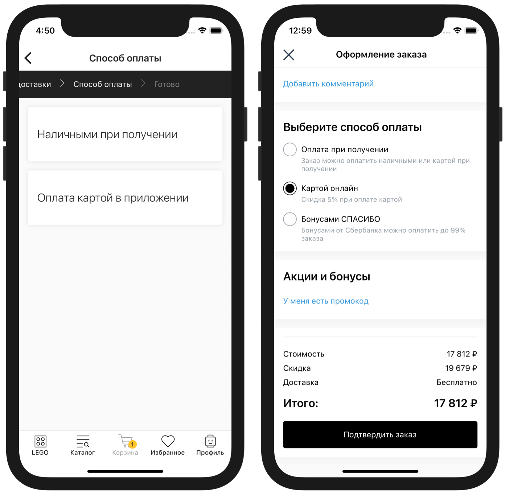

# Оплаты


**IMSHOP Retail Protocol (IRP)** является объектом интеллектуальной собственности ООО «АЙ ЭМ СОЛЮШНЗ» (IMSHOP) и защищён как объект авторского права. Свидетельство о депонировании произведения № 023-014461 от 16 января 2023 г. подтверждает исключительные права ООО «АЙ ЭМ СОЛЮШНЗ» на данные технологии.

IMSHOP Retail Protocol создан по заказу ООО «АЙ ЭМ СОЛЮШНЗ». Использование IMSHOP Retail Protocol допустимо только при взаимодействии с ООО "АЙ ЭМ СОЛЮШНЗ" и наличии действующего лицензионного договора. Более подробно можно ознакомиться [здесь](../api-license.md).


<figure><figcaption><p>Выбор способа оплаты (слева — пошаговое оформление заказа, справа — на одной странице)</p></figcaption></figure>

## Формата запроса и пример <a href="#formata-zaprosa-i-primer" id="formata-zaprosa-i-primer"></a>

### Пример <a href="#primer" id="primer"></a>

**`POST`**`https://api-imshop.store.ru/v1/payments`

```json
{
    "externalUserId": "XXXXXX",
    "country": "RU",
    "hasPreorderItems": true,
    "city": "Москва",
    "promocode": null,
    "deliveryId": "14",
    "pickupLocationId": "100",
    "bonusesSpent": 250,
    "legalEntityMode": true,
    "items": [
        {
            "name": "Тестовый товар 1",
            "id": "00a03026-412a-54fe-a9df-dcf9325f8618",
            "privateId": "3464",
            "configurationId": "3464",
            "quantity": 1
        },
        {
            "name": "Тестовый товар 2",
            "id": "605e0108-dc95-5dab-95a2-7f459da6aade",
            "privateId": "29117",
            "configurationId": "29117",
            "quantity": 1
        }
    ]
}
```

### Описание формата

* **`externalUserId`** — идентификатор покупателя на стороне клиента, если тот авторизован в мобильном приложении, `null` по умолчанию
* **`country`** — ISO код страны, `RU`
* **`hasPreorderItems`** —  в случае если в запросе товары с предзаказом
* **`city`** — стандартизированное имя города из системы ФИАС (или UUID ФИАС, в зависимости от настроек)
* **`promocode`** — прикрепленный промокод в виде строки, `null` по умолчанию
* **`deliveryId`** — идентификатор выбранного способа доставки, см. «[Доставки](broken-reference)»
* **`pickupLocationId`** — выбранный пункт получения заказа, см. «[Доставки](broken-reference)» (`null`, если доставка или не подразумевает выбора ПВЗ)
* **`bonusesSpent`** — кол-во бонусов которые пользователь планирует потратить
* **`legalEntityMode`** – передается и имеет значение `true`, если при оформлении заказа выбрано юридическое лицо
* **`items`** — список товаров в корзине
  * **`id`** — идентификатор товара в IMSHOP.IO
  * **`configurationId`** — идентификатор товарного предложения в системе клиента (идентификатор из фида)
  * **`privateId`** — идентификатор товара в системе клиента (`group_id` из фида)
  * **`quantity`** — количество


Для маркетплейсов.

В полях запроса для каждого товара могут быть переданы идентификаторы магазина/ООО (**в разработке**).


* **`warehouseId`** — (опционально) идентификатор склада/магазина/аутлета/ООО из [фида наличия для маркетплейсов](broken-reference)

```json
{    
    ...
    "items": [
        {
            ...
            "warehouseId": "AF-1416"
            ....
        }
    ]
    ...
}
```

## Ответ


Если в ответе не будут отданы ВСЕ :exclamation:**обязательные поля** - в приложении не отобразятся доставки


### Описание формата

* **`payments`** — список доступных способов оплаты
  * :exclamation:**`id`** — идентификатор, строка **(обязательное поле)**
  * :exclamation:**`title`** — название, строка **(обязательное поле)**
  * **`description`** — описание, строка
  * **`deliveryDiscount`**— процент скидки на выбранную доставку (если для оплаты доставка бесплатна, то 100), число 0-100
  * :exclamation:**`type`** — тип из перечисленных **(обязательное поле)**:
    * **`cash`** - оплата наличными
    * **`card_on_delivery`** - картой курьеру или при получении
    * **`card`** - картой в приложении
    * **`iOS`** - Apple Pay
    * **`android`** - Google Pay

### Пример

```json
{
    "payments": [
        {
            "id": "13",
            "title": "Оплата наличными при получении",
            "description": "Оплата наличными курьеру при получении заказа",
            "type": "cash"
        },
        {
            "id": "001",
            "title": "Картой в приложении",
            "description": "Оплата картой visa или mastercard в приложении",
            "type": "card",
            "deliveryDiscount": 30
        }
    ]
}
```
